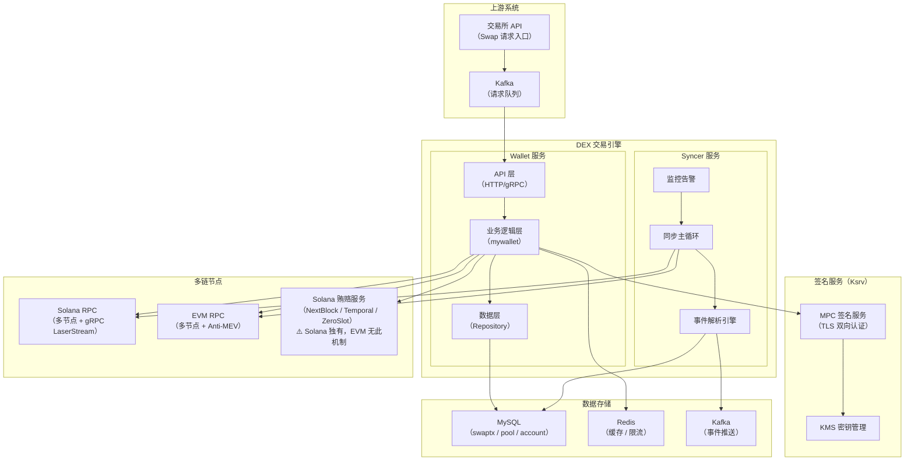
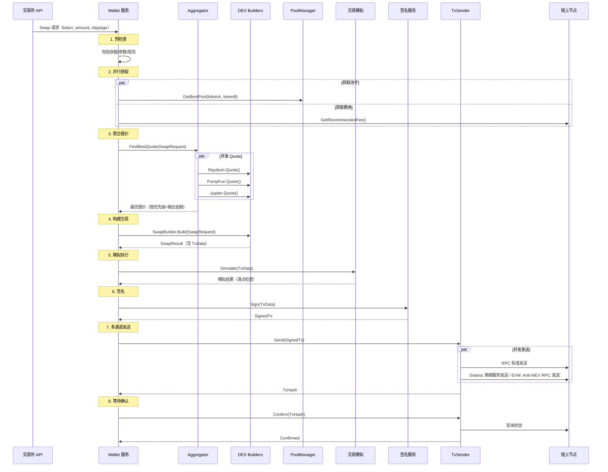
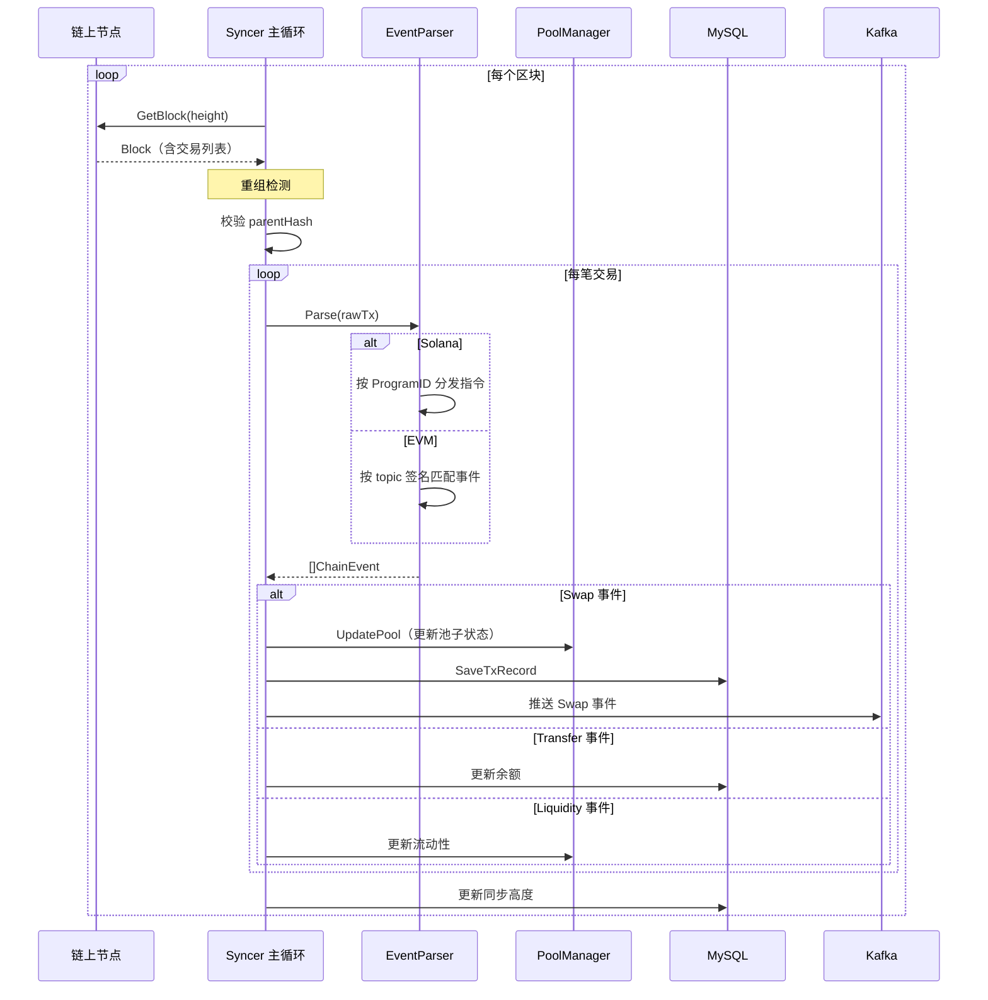
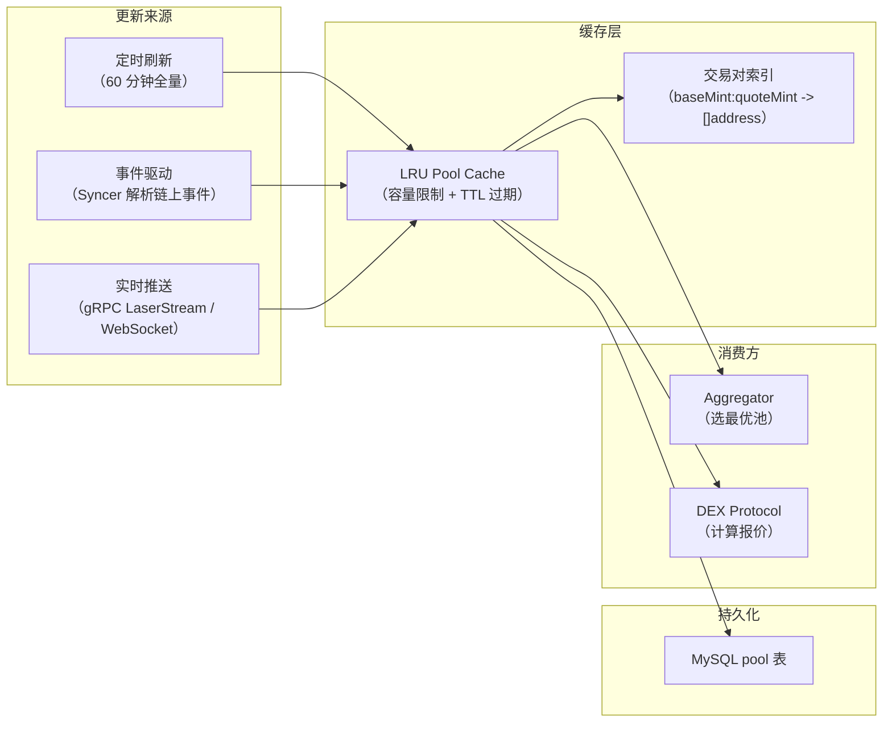
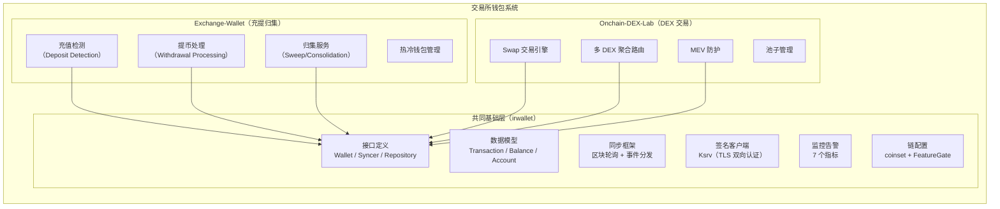

# 模块 00：系统架构设计

> 本模块是纯文档模块，没有可运行代码。重点阐述 DEX 钱包系统的三层架构设计和核心数据流。

## 一、DEX 钱包系统三层架构

### 1.1 系统全景

DEX 钱包系统的核心定位：**在链上 DEX 中代替用户自动完成代币交换**。它不是一个面向终端用户的钱包 App，而是交易所后端的基础设施服务，对接多条链、多个 DEX 协议，为交易所的 Swap 业务提供底层能力。

系统采用**双服务架构**，每个链部署两个服务：

- **Wallet 服务**：处理签名和交易发送。接收上游的 Swap 请求，构建交易，签名，发送到链上。
- **Syncer 服务**：处理区块同步和事件解析。持续追踪链上区块，解析交易事件，更新池子状态，推送结果到消息队列。

### 1.2 基础设施架构图



### 1.3 三层代码抽象

这是本项目**最核心的架构设计**。对标生产中的 irwallet / solwallet / evmwallet 三个仓库的关系：

```
+--------------------------------------------------------------------+
|                    DEX 协议层（最具体）                               |
|  Raydium / Pump.fun / Jupiter / UniSwap / PancakeSwap / Curve       |
|  每个 DEX 有独立的：交易构建、报价逻辑、指令/ABI 解析                  |
+----------------------------+---------------------------------------+
                             | 实现 DexProtocol / SwapBuilder 接口
+----------------------------+---------------------------------------+
|               链特定层（solana / evm）                               |
|  solana: RPC 封装、指令组装、ALT、ComputeBudget、Token2022          |
|  evm:    RPC 封装、ABI 编码、Gas 估算、EIP-1559、Approve 流程       |
|  各自实现 dexwallet 层定义的接口                                     |
+----------------------------+---------------------------------------+
                             | 实现 RPCClient / PoolParser / EventParser 等接口
+----------------------------+---------------------------------------+
|            dexwallet 通用层（跨链公共抽象）                           |
|  对标 irwallet 框架（30,800 行，233 个 Go 文件）                     |
|                                                                      |
|  接口定义:                                                           |
|    SwapBuilder / PoolManager / Aggregator / EventParser              |
|    BribeService（Solana 贿赂/EVM Anti-MEV） / TxSender / RPCClient / Syncer / Repository |
|                                                                      |
|  通用实现:                                                           |
|    BaseAggregator    — 并发 Quote + 优先级排序 + 降级兜底             |
|    LRUPoolCache      — LRU 池子缓存 + 交易对索引                     |
|    BaseTxSender      — 多通道并发发送 + 超时重试                      |
|    Monitor           — 7 个监控指标 + 告警                            |
|    bigint            — 精确金额（禁止 float64）                       |
|    coinset           — 链配置 + FeatureGate                          |
|    alarm             — 可插拔告警接口                                 |
+----------------------------------------------------------------------+
```

### 1.4 抽象的核心决策

| 决策 | 理由 | 举例 |
|------|------|------|
| 接口而非实现 | dexwallet 层只定义接口，不包含任何链特定逻辑 | `SwapBuilder.Build()` 只规定输入输出，不规定内部如何组装指令 |
| 数据模型统一 | Solana 和 EVM 的交易记录共享相同的表结构 | `TxRecord` 的 `SellSymbol/BuySymbol/SlippageBps/PriorityFee` 对两条链通用 |
| 配置驱动差异 | 链的差异通过 `ChainConfig` 参数化 | 新增 Base 链只需添加配置（确认数=10, 出块=2s, EIP1559=true），零代码修改 |
| 可选特性门控 | `FeatureGate` 控制链特有功能 | Solana 启用 `FeatureBribeService`，EVM 启用 `FeatureAntiMEV` |
| 扩展字段兜底 | `Extra map[string]interface{}` 承载链特定数据 | Solana 的 `ComputeUnitLimit`、EVM 的 `GasLimit` 各放各的 Extra 里 |

## 二、核心数据流

### 2.1 Swap 请求流

用户发起一笔 Swap 交易，从请求到链上确认的完整路径：



### 2.2 事件同步流

Syncer 服务持续追踪链上区块，解析交易事件：



### 2.3 池子更新流

池子数据有三个更新来源，保证数据时效性：



## 三、Solana vs EVM 架构差异

### 3.1 核心差异对比

| 维度 | Solana | EVM |
|------|--------|-----|
| **交易模型** | 指令列表（多指令原子执行） | 单笔交易（调用合约函数） |
| **Swap 构建** | 组装指令：ComputeBudget + ATA创建 + Swap指令 | 两步：Approve + Swap（ABI 编码） |
| **体积优化** | Address Lookup Table (ALT) 压缩地址 | 无对应机制 |
| **Gas/费用** | ComputeUnitPrice x ComputeUnitLimit + 贿赂费 | BaseFee + MaxPriorityFee (EIP-1559) |
| **MEV 防护** | 贿赂服务（5个服务商，多地区 CDN） | 私有 mempool (Flashbots) + RBF 加速 |
| **签名算法** | Ed25519 | ECDSA (secp256k1) |
| **Account 模型** | Account-based（每个 Token 独立 Account） | Account-based（ERC20 合约内部映射） |
| **Token 标准** | SPL Token + Token2022 | ERC20 |
| **Approve 机制** | 不需要（直接转移） | 需要（先 Approve 再 Swap） |
| **事件解析** | 解析指令（按 ProgramID 分发） | 解析 Event Log（按 topic 签名匹配） |
| **池子数据** | Account 数据 Borsh 反序列化 | 合约 Storage 读取 + Factory 事件 |
| **出块时间** | 约 400ms | 2-12s（链不同） |
| **确认数** | 1（finalized） | 10-15（链不同） |
| **DEX 数量** | 17+（内盘+AMM+聚合器） | 30+（多链合计） |
| **RPC 特有** | getAccountInfo / simulateTransaction | eth_call / eth_estimateGas / debug_traceTransaction |
| **实时推送** | gRPC LaserStream（200-300ms 延迟） | WebSocket eth_subscribe |

### 3.2 在代码抽象中的体现

**完全通用的逻辑**（放在 dexwallet 层）：
- Aggregator 并发报价 + 比较 + 选最优 + 降级兜底
- Pool 缓存管理（LRU + TTL + 交易对索引）
- TxSender 多通道发送 + 超时重试
- 监控指标（7 个指标对两条链完全一致）
- 数据模型（SwapRequest / SwapResult / Pool / Quote / TxRecord）
- Syncer 主循环框架（轮询 + 分发 + 持久化）

**必须链特定的逻辑**（留在 solana/evm 层）：
- 交易构建方式（指令组装 vs ABI 编码）
- 费用计算（ComputeUnit vs Gas）
- MEV 防护策略（贿赂服务 vs Flashbots）
- 事件解析方式（ProgramID vs topic）
- 池子数据解析（Borsh vs ABI 解码）
- Token 操作差异（SPL Token vs ERC20）

**看起来"差不多"但不该统一的逻辑**：
- Solana 指令解析 vs EVM 事件解析：虽然都是"解析链上交易"，但底层机制完全不同，不应该强行统一实现
- Solana 贿赂服务 vs EVM Anti-MEV RPC：虽然目的相同（防 MEV），但技术路径差异太大

## 四、与 Exchange-Wallet 充提系统的关系

本项目（Onchain-DEX-Lab）与 [Exchange-Wallet](https://github.com/yys9517/exchange-wallet) 是姊妹项目，共同覆盖交易所钱包系统的两大场景：



| 维度 | Exchange-Wallet | Onchain-DEX-Lab |
|------|----------------|-----------------|
| **解决的问题** | 钱怎么进出交易所 | 钱怎么在链上 DEX 交易 |
| **核心操作** | 充值检测、提币签名、归集 | Swap 构建、聚合报价、MEV 防护 |
| **交易复杂度** | 简单转账（Transfer） | 复杂交互（Swap 指令/ABI 调用） |
| **池子管理** | 不涉及 | 核心模块（缓存+更新+最优选择） |
| **DEX 协议** | 不涉及 | 17+ Solana + 30+ EVM |
| **Syncer 关注点** | 充值到账确认 | Swap 事件解析 + 池子状态更新 |
| **共同基础** | irwallet 框架 | irwallet 框架 |

**关键洞察**：两个项目虽然业务完全不同，但底层的 Wallet/Syncer 双服务架构、Repository 数据层、签名服务集成、监控告警是完全一样的。这正是 irwallet 被抽取出来的原因——**复用基础设施，专注业务差异**。

## 五、项目代码结构

```
internal/
  dexwallet/          -- 通用抽象层（对标 irwallet）
    interfaces.go       定义所有接口：SwapBuilder / PoolManager / Aggregator / ...
    model.go            定义数据模型：SwapRequest / Pool / Quote / TxRecord / ...
    aggregator.go       BaseAggregator 通用聚合实现
    pool_cache.go       LRUPoolCache + BasePoolManager
    tx_sender.go        BaseTxSender 多通道发送
    monitor.go          Monitor 监控指标
  solana/             -- Solana 链特定层
    rpc.go              Solana RPC 客户端
    swap_builder.go     指令组装 + ALT + ComputeBudget
    pool_parser.go      Borsh 反序列化
    event_parser.go     按 ProgramID 解析
    bribe.go            5 个贿赂服务商
    dex/                各 DEX 协议（raydium / pumpfun / jupiter）
  evm/                -- EVM 链特定层
    rpc.go              EVM RPC 客户端
    swap_builder.go     ABI 编码 + Gas + Approve
    pool_parser.go      Factory 事件解析
    event_parser.go     按 topic 签名匹配
    antimev.go          Anti-MEV RPC
    dex/                各 DEX 协议（uniswapv2 / pancakev3 / curve）
  bigint/             -- 精确金额
  coinset/            -- 链配置 + FeatureGate
  alarm/              -- 可插拔告警
```

## 六、与生产系统的差距

本模块的架构设计和生产系统的核心思想完全一致。差异在于实现的规模和深度：

| 维度 | 本项目 | 生产系统 |
|------|--------|----------|
| 通用层代码量 | `internal/dexwallet/` 约 600 行 | irwallet 30,800 行（233 个 Go 文件） |
| 接口数量 | 9 个核心接口 | 接口 + Repository + Kafka + Ksrv + ... |
| 数据存储 | 内存 mock | MySQL + Redis + Kafka |
| 签名服务 | 本地签名 | Ksrv（MPC 签名，TLS 双向认证） |
| 部署架构 | 本地运行 | K8s + Docker + 多环境（dev/stage/prod） |
| 文档覆盖 | 本模块 | 9 个详细文档 |

**但核心架构决策是相同的**：三层抽象、接口驱动、配置参数化差异、FeatureGate 门控。理解了这些决策背后的"为什么"，就掌握了系统设计的精髓。
