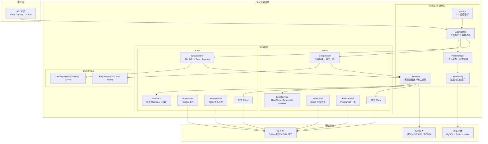
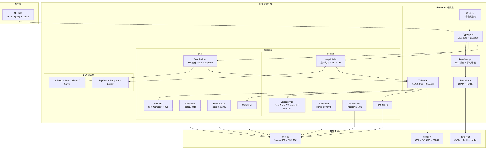

# Onchain-DEX-Lab

> 链上 DEX 交易引擎 -- 从生产系统提炼核心设计，用教学友好的方式重新实现。

## 项目背景

我在交易所做了几年 DEX 钱包开发，日常维护 Solana（17+ DEX）和多条 EVM 链（30+ DEX）的 Swap 交易系统。这个项目把生产中最核心的设计提炼出来，用教学友好的方式重新实现 -- 不是 copy 生产代码，而是理解后重写。面试中被问最多的三个 DEX 相关问题 -- Swap 交易怎么构建、多 DEX 怎么聚合选最优、MEV 怎么防护 -- 在这个项目里都有可运行的代码和测试来回答。与 [Exchange-Wallet](https://github.com/yys9517/exchange-wallet)（充提归集系统）形成姊妹篇：Exchange-Wallet 解决"钱怎么进出交易所"，本项目解决"钱怎么在链上 DEX 交易"。

---

## 30 秒看懂核心亮点

```
Onchain-DEX-Lab
|
+-- [核心亮点 1] Swap 交易引擎 (03-swap-engine)
|   工厂模式选 DEX / Solana 指令组装 / EVM ABI 编码 / 交易模拟验证
|
+-- [核心亮点 2] 多 DEX 聚合路由 (05-aggregator-routing)
|   并发报价 / 优先级排序 / 降级兜底 / 两跳路由 / 灰度发布
|
+-- [核心亮点 3] MEV 防护与交易优化 (06-mev-protection)
|   三明治攻击模拟 / Solana 贿赂服务 / EVM Anti-MEV / 优先费推荐 / RBF 加速
|
+-- [架构灵魂] 三层代码抽象 (internal/dexwallet)
    对标生产 irwallet 框架，从具体实现中提取跨链通用逻辑

    +-----------------------------------------+
    |       dexwallet 通用层 (irwallet)        |   接口定义 + 通用实现
    |  SwapBuilder / Aggregator / PoolManager  |   Solana 和 EVM 共享
    |  EventParser / TxSender                  |
    +-----------------------------------------+
                      |
          +-----------+-----------+
          |                       |
    +-----+------+       +-------+----+
    | solana 层  |       |  evm 层    |         链特定实现
    | 指令组装    |       | ABI 编码   |
    | ALT/CU     |       | Gas/Approve|
    +-----+------+       +-------+----+
          |                       |
    +-----+------+       +-------+----+
    | Raydium    |       | UniSwap    |         DEX 协议层
    | Pump.fun   |       | PancakeSwap|
    | Jupiter    |       | Curve      |
    +------------+       +------------+
```

---

## `make simulate` 效果预览

```
+==============================================================+
|         Onchain DEX Lab -- 端到端全场景模拟                    |
+==============================================================+

[场景 01：RPC 客户端]
  多节点故障转移 / Solana & EVM RPC 封装
  [PASS] (0.02 s)

[场景 02：DEX 协议解析]
  AMM 价格计算 / CLMM Tick 机制 / Bonding Curve 定价
  [PASS] (0.01 s)

[场景 03：Swap 交易引擎]
  工厂模式选 DEX / Solana 指令组装 / EVM ABI 编码 / 交易模拟
  [PASS] (0.03 s)

[场景 04：池子管理]
  LRU 缓存 / 最优池选择 / 状态更新
  [PASS] (0.01 s)

[场景 05：聚合路由]
  并发报价 / 优先级排序 / 降级兜底 / 两跳路由
  [PASS] (0.05 s)

[场景 06：MEV 防护]
  三明治攻击模拟 / Solana 贿赂服务 / EVM Anti-MEV / 优先费推荐
  [PASS] (0.02 s)

[场景 07：事件解析]
  解析器注册 / Swap 事件解析 / Syncer 主循环
  [PASS] (0.02 s)

[场景 08：生产级架构]
  限流 / 多链配置 / 监控告警
  [PASS] (0.03 s)

+==============================================================+
|  模拟结果：8 通过 / 0 失败                                    |
+==============================================================+
```

---

## 项目状态

| 模块 | 阶段 | 测试数 | 可用于生产 |
|------|------|--------|-----------|
| 00-architecture | 文档完成 | - | - |
| 01-rpc-client | Demo | ~8 | 否 -- mock 替代真实节点 |
| 02-dex-protocols | Demo | ~10 | 否 -- 数学模型简化 |
| 03-swap-engine | Demo | ~12 | 否 -- 本地签名替代 MPC |
| 04-pool-management | Demo | ~8 | 否 -- 缺链上解析 |
| 05-aggregator-routing | Demo | ~10 | 否 -- mock 报价数据 |
| 06-mev-protection | Demo | ~8 | 否 -- mock Solana 贿赂服务 / EVM Anti-MEV |
| 07-event-parsing | Demo | ~8 | 否 -- 仅解析 3 种事件 |
| 08-production-architecture | Demo | ~8 | 否 -- 缺中间件集成 |
| internal/dexwallet | 核心库 | ~15 | 设计可复用 |
| internal/bigint | 核心库 | ~10 | 是 |
| internal/coinset | 核心库 | ~6 | 设计可复用 |
| internal/alarm | 核心库 | ~4 | 接口可复用 |

> 所有 demo 使用内存 mock，不依赖外部服务（MySQL / Redis / Kafka / RPC 节点）。核心设计思想与生产系统一致，但不可直接用于生产环境。

---

## 系统架构图



---

## 三层抽象设计

本项目最重要的架构特色是**三层代码抽象**，对标生产中 irwallet（30,800 行）的真实设计：

```
+------------------------------------------------------------------+
|                    DEX 协议层（最具体）                             |
|  Raydium / Pump.fun / Jupiter / UniSwap / PancakeSwap / Curve    |
|  每个 DEX 有独立的交易构建、报价、指令解析                          |
+-----------------------------+------------------------------------+
                              | 实现接口
+-----------------------------+------------------------------------+
|                链特定层（solana / evm）                             |
|  solana: RPC 封装、指令组装、ALT、ComputeBudget、Token2022        |
|  evm:    RPC 封装、ABI 编码、Gas 估算、EIP-1559、Approve 流程     |
|  各自实现 dexwallet 层定义的接口                                   |
+-----------------------------+------------------------------------+
                              | 实现接口
+-----------------------------+------------------------------------+
|            dexwallet 通用层（跨链公共抽象）                         |
|  对标生产中的 irwallet 框架                                        |
|                                                                    |
|  定义接口:                                                         |
|    SwapBuilder      -- 构建 Swap 交易                              |
|    PoolManager      -- 池子管理与缓存                              |
|    Aggregator       -- 多 DEX 聚合与路由                           |
|    EventParser      -- 链上事件解析                                |
|    BribeService     -- 交易加速服务（Solana 贿赂 / EVM Anti-MEV）  |
|    TxSender         -- 交易发送与确认                              |
|    Alarm            -- 监控告警                                    |
|                                                                    |
|  通用实现:                                                         |
|    bigint           -- 精确金额（禁止 float64）                    |
|    coinset          -- 链配置 + FeatureGate                        |
|    ratelimiter      -- 令牌桶限流                                  |
|    cache            -- LRU 缓存                                    |
|    repository       -- 数据存储接口                                |
|    datamodel        -- 交易/余额/池子数据模型                      |
+--------------------------------------------------------------------+
```

**设计关键决策**：

| 决策 | 说明 |
|------|------|
| 接口而非实现 | dexwallet 只定义接口，不包含任何链特定逻辑 |
| 数据模型统一 | SwapRequest / Pool / ChainEvent 对 Solana 和 EVM 通用 |
| 配置驱动差异 | 链的差异通过 `coinset.ChainConfig` 参数化（确认数、签名算法、精度等） |
| 可选特性 | FeatureGate 机制控制链特有功能（EnableBloomFilter / EnableALT 等） |
| Extra 字段 | 链特定字段用 `Extra map[string]interface{}` 承载，不污染通用模型 |

---

## 各章节导航

| 模块 | 核心话题 | 代码亮点 | 文档亮点 |
|------|---------|---------|---------|
| [00-architecture](./00-architecture/) | 三层架构设计、数据流 | Mermaid 架构图 | irwallet 抽取过程决策 |
| [01-rpc-client](./01-rpc-client/) | Solana & EVM RPC、故障转移 | StableClient 多节点切换 | RPC 方法对比表 |
| [02-dex-protocols](./02-dex-protocols/) | AMM / CLMM / Bonding Curve | 纯 Go 价格计算引擎 | 协议数学原理推导 |
| [03-swap-engine](./03-swap-engine/) | 交易构建、工厂模式 | SwapBuilder 接口 + 6 个实现 | Solana vs EVM 构建流程对比 |
| [04-pool-management](./04-pool-management/) | 池子缓存、最优池选择 | LRU 缓存 + 交易对索引 | 缓存策略与失效机制 |
| [05-aggregator-routing](./05-aggregator-routing/) | 并发报价、聚合路由 | BaseAggregator 通用聚合 | 优先级策略与灰度发布 |
| [06-mev-protection](./06-mev-protection/) | MEV 防护（Solana 贿赂 / EVM Anti-MEV） | 三明治攻击模拟 | 5 个 Solana 贿赂服务商对比 |
| [07-event-parsing](./07-event-parsing/) | 事件解析、Syncer 同步 | 解析器注册机制 | Solana 指令 vs EVM 事件日志 |
| [08-production-architecture](./08-production-architecture/) | 限流、监控、多链扩展 | 令牌桶限流器 | 生产级运维清单 |
| [interview-prep](./interview-prep/) | 面试 Q&A、场景题 | - | 口语化回答模板 |

---

## 代码复用架构：对标 irwallet

**生产中的真实情况**：

- **irwallet**（30,800 行，233 个 Go 文件）：跨链通用框架，被 solwallet 和 evmwallet 共同依赖
- **solwallet**（200K+ 行）：实现 irwallet 接口，增加 Solana 特有逻辑
- **evmwallet**（800+ 文件）：实现 irwallet 接口，增加 EVM 特有逻辑

**抽取过程**：

最初 solwallet 和 evmwallet 是完全独立的项目。随着业务发展，发现大量重复代码：

```
重复代码识别：
  [1] 数据模型      -- swaptx 表结构 / Pool 模型 / TxRecord    --> 提取到 dexwallet/model.go
  [2] Syncer 主循环 -- 区块轮询 + 事件分发 + 持久化            --> 提取到 dexwallet/interfaces.go (Syncer)
  [3] 聚合逻辑      -- 并发 Quote + 比较 + 选最优 + 降级        --> 提取到 dexwallet/aggregator.go
  [4] 池子缓存      -- LRU 缓存 + TTL + 交易对索引             --> 提取到 dexwallet/pool_cache.go
  [5] 交易发送      -- 多通道并发 + 超时重试 + 确认追踪         --> 提取到 dexwallet/tx_sender.go
  [6] 监控告警      -- 7 个指标 + 可插拔告警通道                --> 提取到 dexwallet/monitor.go
  [7] 签名客户端    -- TLS 双向认证 + Ed25519/ECDSA             --> 提取到 dexwallet (接口)
```

**不应该抽取的部分**（面试重点）：

- Solana 的指令解析（按 ProgramID 分发）vs EVM 的事件解析（按 topic 签名匹配）-- 底层机制完全不同，强行统一会导致抽象泄漏
- Solana 的 ComputeBudget / ALT vs EVM 的 Gas / Approve -- 概念不可对齐

**本项目的对应关系**：

| 生产系统 | 本项目 | 行数 |
|----------|--------|------|
| irwallet | internal/dexwallet | ~600 行 |
| irwallet/coinset | internal/coinset | ~200 行 |
| irwallet/alarm | internal/alarm | ~90 行 |
| irwallet/bigint | internal/bigint | ~140 行 |
| solwallet | internal/solana + Solana DEX | Demo |
| evmwallet | internal/evm + EVM DEX | Demo |

---

## 目录结构

```
onchain-dex-lab/
|
|-- 00-architecture/              系统架构设计（纯文档，重点展示三层抽象）
|-- 01-rpc-client/                Solana & EVM RPC 客户端封装
|   +-- demo/
|-- 02-dex-protocols/             DEX 协议深度解析（AMM / CLMM / Bonding Curve）
|   +-- demo/
|-- 03-swap-engine/               Swap 交易构建引擎  [核心]
|   +-- demo/
|-- 04-pool-management/           流动性池解析与管理
|   +-- demo/
|-- 05-aggregator-routing/        多 DEX 聚合与最优路由  [核心]
|   +-- demo/
|-- 06-mev-protection/            MEV 防护与交易优化  [核心]
|   +-- demo/
|-- 07-event-parsing/             链上事件解析与同步
|   +-- demo/
|-- 08-production-architecture/   生产级架构（多链扩展 / 限流 / 监控）
|   +-- demo/
|
|-- cmd/
|   |-- simulate/                 端到端演示（串联 8 个场景）
|   +-- dex-wallet/               DEX 钱包服务主入口（stub）
|
|-- internal/                     跨链通用基础库（对标 irwallet）
|   |-- dexwallet/                核心抽象层（接口定义 + 通用实现）
|   |   |-- interfaces.go         SwapBuilder / PoolManager / Aggregator / EventParser 等接口
|   |   |-- model.go              SwapRequest / SwapResult / Pool / Quote 等数据模型
|   |   |-- aggregator.go         通用聚合逻辑（并发 Quote -> 比较 -> 选最优）
|   |   |-- pool_cache.go         通用 LRU 池子缓存
|   |   |-- tx_sender.go          通用交易发送与确认追踪
|   |   +-- monitor.go            通用监控指标收集
|   |-- solana/                   Solana 链特定实现（实现 dexwallet 接口）
|   |   |-- rpc.go                Solana RPC 客户端
|   |   |-- swap_builder.go       Solana 交易构建（指令组装 / ALT / ComputeBudget）
|   |   |-- pool_parser.go        Solana 池子解析（Borsh 反序列化）
|   |   |-- event_parser.go       Solana 事件解析（指令分发）
|   |   |-- bribe.go              贿赂服务（NextBlock / Temporal / ZeroSlot 等）
|   |   +-- dex/                  各 DEX 协议实现
|   |       |-- raydium.go
|   |       |-- pumpfun.go
|   |       +-- jupiter.go
|   |-- evm/                      EVM 链特定实现（实现 dexwallet 接口）
|   |   |-- rpc.go                EVM RPC 客户端
|   |   |-- swap_builder.go       EVM 交易构建（ABI 编码 / Gas / Approve）
|   |   |-- pool_parser.go        EVM 池子解析（Factory 事件）
|   |   |-- event_parser.go       EVM 事件解析（topic 签名匹配）
|   |   |-- antimev.go            Anti-MEV RPC 节点
|   |   +-- dex/                  各 DEX 协议实现
|   |       |-- uniswapv2.go
|   |       |-- pancakev3.go
|   |       +-- curve.go
|   |-- bigint/                   精确金额（禁止 float64）
|   |-- coinset/                  链配置 + FeatureGate
|   +-- alarm/                    告警接口（可插拔）
|
|-- interview-prep/               面试准备（口语化 Q&A + 场景题 + 深挖题）
|-- config/                       配置文件（dev.yaml）
|-- docs/                         数据库 schema + API 设计
|
|-- README.md                     主文档（本文件）
|-- CLAUDE.md                     项目指令
|-- Makefile                      构建命令
|-- go.mod
+-- go.sum
```

---

## 快速开始

### 前置条件

- Go 1.22+
- Make

### 运行所有测试

```bash
make test
```

### 端到端全场景模拟

```bash
make simulate
```

### 运行单个模块的 demo

```bash
# 用法：make demo MOD=<模块目录名>
make demo MOD=01-rpc-client
make demo MOD=03-swap-engine
make demo MOD=05-aggregator-routing
```

### 其他命令

```bash
make fmt        # 代码格式化
make lint       # 代码检查
make clean      # 清理缓存
```

---

## 与 Exchange-Wallet 的关系

| 项目 | 内容 | 关注点 |
|------|------|--------|
| [Exchange-Wallet](https://github.com/yys9517/exchange-wallet) | 充提归集系统 | 钱怎么进出交易所 |
| **Onchain-DEX-Lab** | DEX 交易引擎 | 钱怎么在链上交易 |
| 共同基础 | irwallet 跨链框架 | 双服务架构 + 接口抽象 |

**共享的架构思想**：

- **双服务架构**：Wallet 服务（签名 + 交易）+ Syncer 服务（区块同步 + 事件解析）
- **三层代码分离**：通用框架层 -> 链特定层 -> 业务协议层
- **接口驱动设计**：核心逻辑依赖接口而非实现，便于测试和扩展
- **配置参数化**：链差异通过 coinset 配置，新增链不改业务代码

**差异点**：

| 维度 | Exchange-Wallet | Onchain-DEX-Lab |
|------|----------------|-----------------|
| 核心操作 | 充值 / 提现 / 归集 | Swap / 聚合 / 路由 |
| 关键挑战 | UTXO 管理、确认数、重组 | 滑点控制、MEV 防护、报价比较 |
| 链上交互 | Transfer（简单） | Swap（复杂，涉及 DEX 合约） |
| 数据模型 | outboundtx / deposit | swaptx / pool / quote |

---

## 生产差距总表

| 维度 | 本项目 | 生产系统 |
|------|--------|----------|
| DEX 数量 | Solana 3 + EVM 3 = 6 | Solana 17+ / EVM 30+ |
| 链支持 | 模拟（mock） | Solana + BSC + ETH + Base + XLayer + Monad |
| 签名 | 本地 Ed25519 / ECDSA | 远程 MPC 签名（ksrv，TLS 双向认证） |
| 数据存储 | 内存 map | MySQL + Redis + Kafka |
| 池子数据 | 静态 mock | 链上实时解析 + gRPC 推送 |
| 贿赂服务（Solana 独有） | mock 接口 | 5 个服务商真实集成（EVM 无贿赂，用 Anti-MEV RPC） |
| 事件解析 | 3 种 | 70+ 种（74 个解析文件） |
| 部署 | 本地运行 | K8s + Docker + 多环境 |
| 监控 | 控制台输出 | 钉钉 / Lark + 7 个监控指标 |
| 框架复用 | internal/dexwallet | irwallet（30,800 行，被 2 个项目共同依赖） |

**但核心设计思想完全一致**：三层代码抽象、工厂模式选 DEX、并发聚合比价、优先级降级、交易模拟验证、限流背压 -- 这些架构决策在 demo 和生产系统中是相同的。

---

## 技术栈

| 类别 | 技术 | 说明 |
|------|------|------|
| 语言 | Go 1.22+ | 全项目统一 |
| 精确计算 | shopspring/decimal | 禁止 float64，全部 big.Int / decimal.Decimal |
| EVM 类型 | go-ethereum v1.14.x | ABI 编码、类型定义（仅类型依赖） |
| 并发控制 | sync.Mutex / RWMutex / atomic | 所有共享数据结构并发安全 |
| 日志 | log/slog（demo）/ logrus（cmd） | 标准库优先 |
| 测试 | testing（标准库） | 内存 mock，零外部依赖 |
| 构建 | Make | test / simulate / demo / lint |
| 配置 | YAML | 多环境配置 |
| 错误处理 | fmt.Errorf + %w | 链式传递，保留错误上下文 |

---

## License

MIT
