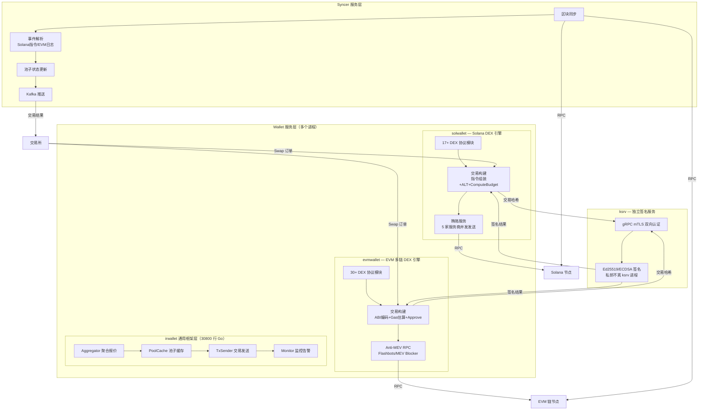
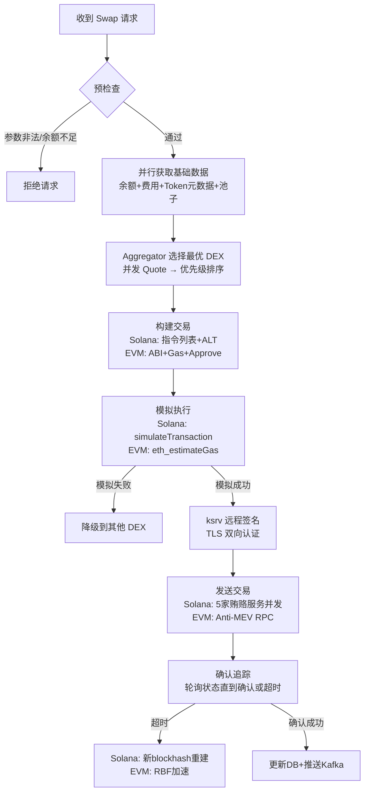
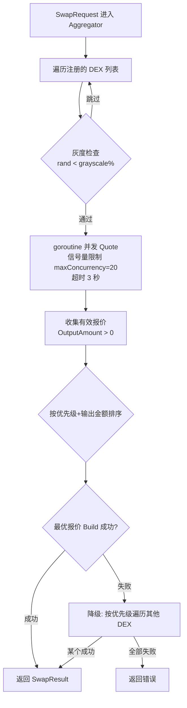
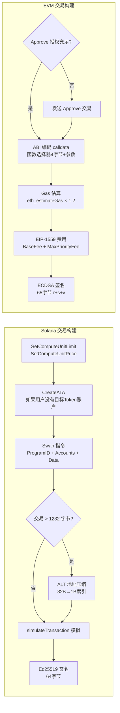
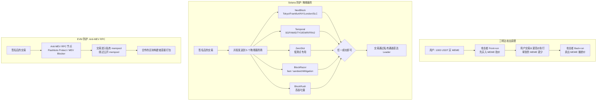
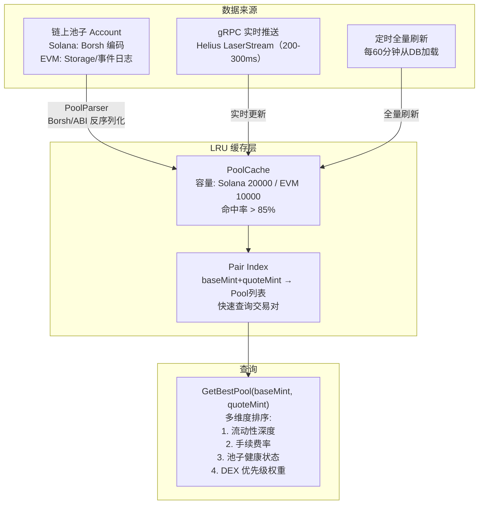
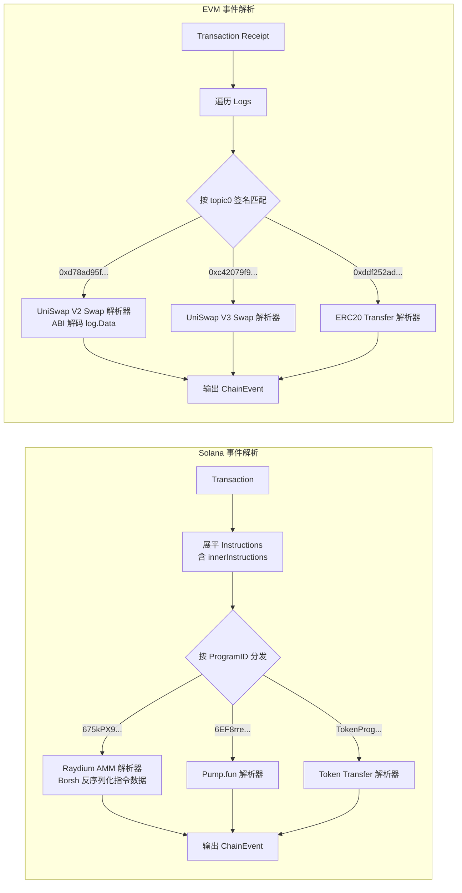
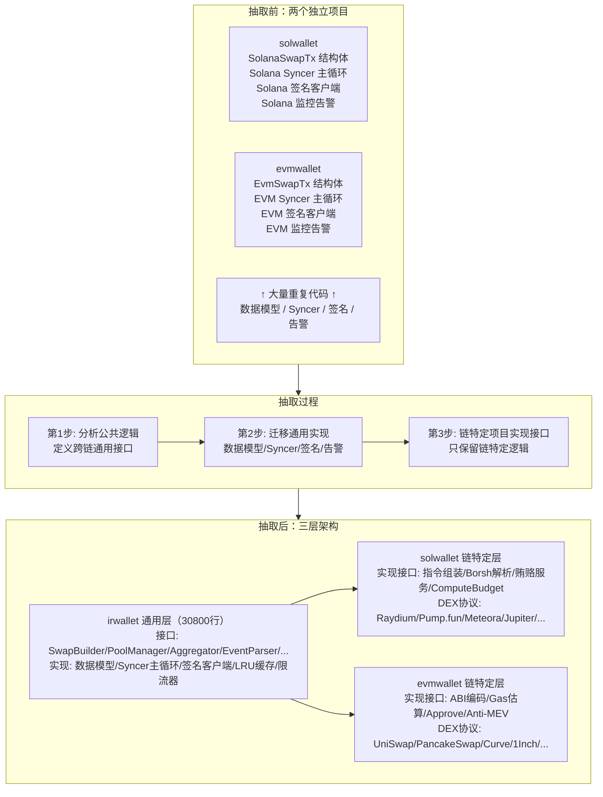

# DEX 交易引擎 -- 面试准备材料

> 基于本项目（Onchain-Dex-Lab）及其背后的生产经验（solwallet / evmwallet / irwallet）整理。口语化第一人称，可直接对照说给面试官听。
>
> 配合使用：每个模块的 `notes.md`（技术深度）+ `goals.md`（知识自检）+ 本文档（面试口语版）。

---

## 第一部分：项目概览（开场白）

**2 分钟项目介绍**

我做的是交易所 DEX 交易引擎，核心是让用户能在链上各种 DEX 上进行 Swap 交易。从部署角度看是**两个核心服务**：**Wallet 服务**负责交易构建、签名、发送，**Syncer 服务**负责区块同步、事件解析、池子数据更新。

最核心的设计原则是**三层代码抽象**——irwallet 通用层定义跨链通用接口和数据模型，solana/evm 链特定层各自实现这些接口，最上层是具体的 DEX 协议模块。这套架构是我在做了一年多的多链 DEX 开发后，从 solwallet 和 evmwallet 两个独立项目中提炼出来的。irwallet 有 30800 行 Go 代码、233 个文件，solwallet 和 evmwallet 共享它的全部通用逻辑，新增一条链只需要实现接口，不需要重复写聚合报价、池子缓存、交易发送这些核心流程。

三个角色各自负责什么：

**交易所**：业务方，下 Swap 订单，接收交易结果通知。

**Wallet 服务**（实际是多个进程，按链类型分）：
- Solana 用 **solwallet**（200K+ 行代码），接入 17+ 个 DEX（Pump.fun/Raydium/Meteora/Jupiter 等），5 个贿赂服务商（NextBlock/Temporal/ZeroSlot/BlockRazor/BlockRush）
- EVM 用 **evmwallet**（800+ 文件），接入 30+ 个 DEX（UniSwap/PancakeSwap/Curve/1Inch 等），Anti-MEV RPC 节点防护
- 底层共用 **irwallet** 通用框架——irwallet 把聚合报价、池子缓存、交易发送、监控告警等公共逻辑全部抽象出来，各链实现只需适配链特定的 RPC 调用和交易构建
- 签名走 **ksrv** 远程签名服务（TLS 双向认证），**不持有私钥**

**Syncer 服务**：区块同步 + 事件解析 + 池子状态更新 + Kafka 推送。



**各角色的分工：**

| 角色 | 组件 | 职责 |
|---|---|---|
| 业务方 | 交易所 | 下 Swap 订单；接收 Kafka 交易结果通知 |
| Wallet（Solana） | solwallet | 17+ DEX Swap 构建；5 家贿赂服务并发发送；指令组装+ALT+ComputeBudget |
| Wallet（EVM） | evmwallet | 30+ DEX Swap 构建；Anti-MEV RPC；ABI 编码+Gas 估算+Approve+RBF |
| 通用框架 | irwallet | 聚合报价、池子 LRU 缓存、多通道发送、监控告警、数据模型、限流器 |
| 签名服务 | ksrv | gRPC TLS 双向认证；Ed25519/ECDSA 签名；私钥永不离开 ksrv 进程 |
| 同步服务 | Syncer | 区块轮询+gRPC 推送；事件解析（Solana 指令/EVM 日志）；池子更新；Kafka 通知 |

---

## 第二部分：核心流程图（共 7 个）

### 2.1 Swap 交易完整流程



走一遍具体的例子。假设用户在 Solana 上要用 1000 USDT 买一个叫 PEPE2 的 meme 币。

**预检查阶段**：系统验证用户账户是否存在且有效、USDT 余额是否 >= 1000、PEPE2 是否在支持列表中（全新 Token 需先过安全检查）、滑点设置是否在合理范围内（通常 0.5%-50%，meme 币建议 5% 以上）。EVM 链还要额外检查 Approve 授权额度。

**并行数据获取阶段**：系统并发发起 4 组 RPC 调用——(1) 用户 USDT Token Account 余额（确认链上余额和 DB 一致）；(2) 当前优先费推荐值（最近几个区块 ComputeUnitPrice 的 P50/P75）；(3) PEPE2 Token 元数据（精度、是否 Token2022、是否有转账税）；(4) 所有有 USDT/PEPE2 或 PEPE2/SOL 交易对的池子数据。四个调用互不依赖，并行执行把延迟从串行的 4 倍降到约 1 倍，Solana 上大约 200-400ms 全部拿到。

**DEX 选择阶段**：关键判断——PEPE2 当前处于什么阶段？如果还在 Pump.fun Bonding Curve（未毕业），走内盘交易，但 Pump.fun 只支持 SOL 计价，需要先 USDT→SOL（Raydium 池子）再 SOL→PEPE2（Pump.fun），这是两跳路由。如果已毕业到 Raydium AMM，系统并发调用 Raydium AMM/CPMM、Meteora、PumpAMM 等所有有 PEPE2 池子的 DEX 获取报价。如果所有直接路由和两跳都不行，降级到 Jupiter 聚合器兜底。

**构建交易阶段**：假设选中 Raydium AMM。组装指令列表：

```
指令列表:
  [0] SetComputeUnitLimit   → 200000 CU (Raydium AMM swap 约 150000 CU，留余量)
  [1] SetComputeUnitPrice   → 50000 micro-lamports (当前推荐值)
  [2] CreateAssociatedTokenAccount → 为 PEPE2 创建 ATA (如果不存在)
  [3] Raydium AMM Swap      → 池子地址 + 输入 1000 USDT + 最小输出 4750000 PEPE2 (5% 滑点)
```

如果所有指令引用的 Account 太多导致交易超过 1232 字节，使用 Address Lookup Table（ALT）压缩地址引用（32 字节 → 1 字节索引）。

**模拟执行阶段**：调用 Solana RPC `simulateTransaction`，返回结果示例：

```json
{
  "result": {
    "value": {
      "err": null,
      "logs": [
        "Program ComputeBudget111... invoke [1]",
        "Program ComputeBudget111... success",
        "Program ATokenGPvbdGV... invoke [1]",
        "Program ATokenGPvbdGV... success",
        "Program 675kPX9MHTjS2... invoke [1]",
        "Program log: ray_log: SwapBaseIn {...}",
        "Program 675kPX9MHTjS2... success"
      ],
      "unitsConsumed": 147230
    }
  }
}
```

检查 `err` 为 null（执行成功），用 `unitsConsumed`（147230）更新 ComputeUnitLimit 为 `147230 * 1.2 ≈ 176676`，避免设置过高浪费优先费。

**签名 → 发送 → 确认**：交易数据发到 ksrv，Ed25519 签名（64 字节），通过 5 个贿赂服务商并发发送（附带 30000 lamports tip），同时普通 RPC 备份发送。轮询 `getSignatureStatuses`，通常 1-3 个 slot（0.4-1.2 秒）内确认。整条链路从请求到确认在 2-5 秒内完成。

---

### 2.2 多 DEX 聚合报价流程



Aggregator 的核心逻辑在 irwallet 通用层实现（`aggregator.go`），Solana 和 EVM 的聚合流程完全一致，只是注册的 DEX 列表不同。

**Solana DEX 优先级分档（17+ 个）：**

| 优先级 | DEX | DexID | 说明 |
|--------|-----|-------|------|
| High (1) | Pump.fun | `pump_fun` | Bonding Curve 内盘，Token 未毕业时走这里 |
| High (1) | Moonshot | `moonshot` | 同上 |
| Medium (2) | Raydium AMM | `raydium_amm` | 恒定乘积 x*y=k |
| Medium (2) | Raydium CPMM | `raydium_cpmm` | 改进的恒定乘积 |
| Medium (2) | Raydium CLMM | `raydium_clmm` | 集中流动性 |
| Medium (2) | PumpAMM | `pump_amm` | Pump 毕业后的 AMM 池 |
| Medium (2) | Meteora AMM | `meteora_amm` | 动态 AMM |
| Medium (2) | Meteora DLMM | `meteora_dlmm` | 离散流动性 |
| Low (3) | Jupiter | `jupiter` | 聚合器兜底 |
| Low (3) | AlphAggregator | `alph_aggregator` | 聚合器兜底 |

**EVM DEX 优先级分档（30+ 个）：**

| 优先级 | DEX | DexID | 说明 |
|--------|-----|-------|------|
| Medium (2) | UniSwap V2/V3/V4 | `uniswap_v2/v3/v4` | 标准 AMM/CLMM |
| Medium (2) | PancakeSwap V2/V3 | `pancake_v2/v3` | BSC 主力 |
| Medium (2) | Curve | `curve` | StableSwap 稳定币低滑点 |
| Low (3) | 1Inch | `1inch` | 聚合器兜底 |
| Low (3) | ParaSwap | `paraswap` | 聚合器兜底 |
| Low (3) | Odos | `odos` | 聚合器兜底 |

**灰度机制**：新接入 DEX 时不会立刻全量启用，通过 `GrayscalePercent` 参数控制（如先设 5%），Aggregator 在遍历 DEX 列表时对灰度中的 DEX 生成随机数，`rand < grayscale%` 才调用 Quote，精确控制使用比例。观察 24 小时无异常后逐步提高到 20% → 50% → 100%。

**两跳路由**：如果没有直接的交易对池子，尝试通过中间资产两跳。中间资产优先级：SOL（Solana）/ WETH/WBNB（EVM）> USDC > USDT。两跳的代价是 Gas 翻倍、滑点叠加，但能覆盖更多长尾交易对。

**并发报价的代码结构**（对标 `aggregator.go`）：

```go
// BaseAggregator.FindBestQuote 核心逻辑
sem := make(chan struct{}, a.maxConcurrency) // 信号量限制并发数（默认 20）
quoteCtx, cancel := context.WithTimeout(ctx, 3*time.Second) // 统一超时
for _, entry := range activeEntries {
    go func(e *DexEntry) {
        sem <- struct{}{}        // 获取信号量
        defer func() { <-sem }() // 释放
        q, err := e.Protocol.Quote(quoteCtx, pool, req.Amount, req.Direction)
        // ...
    }(entry)
}
// 收集后排序：先按 Priority 升序，同优先级按 OutputAmount 降序
sort.Slice(quotes, func(i, j int) bool {
    if quotes[i].Priority != quotes[j].Priority {
        return quotes[i].Priority < quotes[j].Priority
    }
    return quotes[i].OutputAmount.Cmp(quotes[j].OutputAmount) > 0
})
```

---

### 2.3 Solana 交易构建 vs EVM 交易构建



**Solana 交易结构**：一笔 Swap 交易是一个指令列表（Instructions），每个指令包含 Program ID、涉及的 Account 列表、序列化数据。典型 Raydium AMM Swap 包含 3-5 个指令：

```
Transaction (max 1232 bytes):
├── Header: numSignatures=1, numReadonlySigned=0, numReadonlyUnsigned=N
├── Signatures: [Ed25519 signature, 64 bytes]
├── Message:
│   ├── RecentBlockhash: "9Wyz..." (有效期约60秒/150 slots)
│   ├── AccountKeys: [pubkey1, pubkey2, ...] (每个32字节)
│   ├── Instructions:
│   │   ├── [0] ComputeBudget.SetComputeUnitLimit(200000)
│   │   │       ProgramID: ComputeBudget111111111111111111111111
│   │   │       Data: [0x02, 0x40, 0x0d, 0x03, 0x00]  // 指令类型 + little-endian u32
│   │   ├── [1] ComputeBudget.SetComputeUnitPrice(50000)
│   │   │       ProgramID: ComputeBudget111111111111111111111111
│   │   │       Data: [0x03, 0x50, 0xc3, 0x00, 0x00, 0x00, 0x00, 0x00, 0x00]
│   │   ├── [2] CreateAssociatedTokenAccount (if needed)
│   │   │       ProgramID: ATokenGPvbdGVxr1b2hvZbsiqW5xWH25efTNsLJA8knL
│   │   └── [3] Raydium AMM Swap
│   │           ProgramID: 675kPX9MHTjS2zt1qfr1NYHuzeLXfQM9H24wFSUt1Mp8
│   │           Accounts: [amm_id, authority, open_orders, target_orders,
│   │                      base_vault, quote_vault, market_program, ...]
│   │           Data: [instruction_discriminator(8 bytes), amount_in, min_amount_out]
│   └── AddressLookupTables (if needed): [ALT address → compressed indices]
```

**EVM 交易结构**：单一合约调用，ABI 编码的 calldata：

```
Transaction:
├── to: 0x7a250d5630B4cF539739dF2C5dAcb4c659F2488D  (UniSwap V2 Router)
├── value: 0x0  (ERC20 swap，主币金额为 0)
├── data (calldata):
│   ├── 函数选择器: 0x38ed1739  (swapExactTokensForTokens)
│   ├── amountIn:     0x...  (uint256, 输入金额)
│   ├── amountOutMin: 0x...  (uint256, 最小输出)
│   ├── path:         [tokenIn, tokenOut]  (address[])
│   ├── to:           0x...  (接收地址)
│   └── deadline:     0x...  (uint256, 过期时间)
├── gasLimit: estimateGas × 1.2
├── maxFeePerGas: BaseFee × 1.2 + MaxPriorityFee
├── maxPriorityFeePerGas: P50 推荐值
├── nonce: 本地缓存严格递增
├── chainId: 56 (BSC) / 1 (ETH) / 8453 (Base)
└── signature: ECDSA r(32B) + s(32B) + v(1B) = 65 bytes
```

**关键差异总结：**

| 维度 | Solana | EVM |
|------|--------|-----|
| 交易结构 | 指令列表（多个 Program 调用） | 单一合约调用（ABI calldata） |
| 大小限制 | 1232 字节硬限制，超出用 ALT 压缩 | 无大小限制，Gas 与 calldata 长度相关 |
| 账户模型 | 需创建 ATA 才能接收 Token | 需 Approve 授权 Router 操作 Token |
| 签名算法 | Ed25519（64 字节） | ECDSA secp256k1（65 字节 r+s+v） |
| 费用模型 | 基础费 5000 lamports + 优先费 + 贿赂费 | EIP-1559: (BaseFee + PriorityFee) × GasUsed |
| MEV 防护 | 贿赂服务（5 家私有通道） | Anti-MEV RPC（私有 mempool） |
| Token 标准 | Token Program + Token2022 | ERC-20（部分有转账税） |
| 交易过期 | blockhash 约 60 秒自动过期 | 不过期，需 RBF 手动替换 |

---

### 2.4 MEV 防护与贿赂服务



**为什么需要贿赂服务**：Solana 没有公开的 mempool，交易直接发给当前 slot 的 leader 节点。但通过普通 RPC 发送时，交易可能被转发到多个节点，仍有被截获风险。更重要的是，网络拥堵时 leader 的处理队列可能已满，普通交易会被丢弃。贿赂服务解决的是"可靠到达 + 优先处理"两个问题——通过私有通道直达 leader，并附带 tip 激励优先打包。

**5 个贿赂服务商差异：**

| 服务商 | CDN 节点 | 特点 | 适用场景 |
|--------|---------|------|----------|
| NextBlock | Tokyo/Frankfurt/NY/London/SLC | 全球覆盖，延迟低 | 通用 |
| Temporal | SGP/AMS/TYO/EWR/FRA2 | 稳定性好 | 主力服务商 |
| ZeroSlot | — | 低滑点优化 | 大额交易 |
| BlockRazor | — | fast + sandwichMitigation 双模式 | 需要防三明治时 |
| BlockRush | — | 高吞吐量 | 批量发送 |

**费用计算示例**（一笔 Solana Swap 交易）：

```
基础费:      5,000 lamports          ≈ $0.001  (固定，每签名 5000)
优先费:      50,000 × 200,000 / 10^6
           = 10,000 lamports          ≈ $0.002  (CU Price × CU Limit / 10^6)
贿赂费(tip): 30,000 lamports          ≈ $0.006  (转账到贿赂服务指定的 tip 账户)
─────────────────────────────────────────────
总费用:      45,000 lamports          ≈ $0.009

效果: 1-2 个 slot（0.4-0.8 秒）内确认
```

**EVM Anti-MEV 费用**：

```
Gas 费用:    BaseFee(30 Gwei) + PriorityFee(2 Gwei) = 32 Gwei
GasUsed:     150,000 (UniSwap V2 swap)
总费用:      32 × 150,000 = 4,800,000 Gwei = 0.0048 ETH ≈ $12
Anti-MEV:    免费（Flashbots Protect 不收额外费用）
```

**多通道并发发送策略**：每笔交易同时通过多个贿赂服务商发送，只要任一通道成功就行。好处：提高成功率（某个服务商不可用不影响）、降低延迟（取最快的那个）、容灾（曾遇到某服务商宕机 30 分钟，多通道策略保证业务不受影响）。

---

### 2.5 池子管理与缓存更新



**Pool 数据模型**（对标 `model.go` 的 Pool 结构体）：

```go
type Pool struct {
    Address      string      // 池子合约/账户地址
    DexID        DexID       // 所属 DEX 标识 (raydium_amm / uniswap_v2 等)
    ChainID      ChainID     // 链标识
    ProtocolType ProtocolType // amm / clmm / bonding_curve / stable_swap / dlmm

    BaseMint     string      // 基础代币地址
    QuoteMint    string      // 计价代币地址
    Liquidity    *big.Int    // 流动性（最小单位）
    FeeRate      uint64      // 手续费率（基点，30 = 0.3%）

    State        PoolState   // active / inactive / need_update
    UpdatedAt    time.Time   // 最后更新时间

    Extra map[string]interface{} // 链特定扩展字段
}
```

**为什么 Pool 模型可以同时表示 Solana 和 EVM 的池子**：Aggregator 做比价时只需要 ProtocolType（决定报价算法）、Liquidity（决定滑点）、FeeRate（决定手续费）、State（过滤不可用池子）。这四个字段完全链无关，一个 Raydium AMM 池子和一个 UniSwap V2 池子只要这四个字段有值就能统一比较。链特定的原始数据（Solana Raydium 的 amm_id/open_orders/base_vault 十几个 Account 地址，EVM UniSwap 的 reserve0/reserve1/factory 等）存在 Extra 字段中，SwapBuilder 构建交易时按需取出。

**Solana 池子解析**：不同 DEX 的 Account Layout 完全不同——Raydium AMM 池子账户 700+ 字节 Borsh 编码，Pump.fun Bonding Curve 账户约 200 字节。解析需要按每个 DEX 的 IDL 定义反序列化。

**EVM 池子解析**：通过读取合约 Storage 或解析 Factory 合约的 `PairCreated` / `PoolCreated` 事件日志。UniSwap V2 的 `getReserves()` 返回 `(reserve0, reserve1, blockTimestampLast)`。

**缓存策略三层架构**：
1. **LRU 本地内存缓存**：Solana 约 10 万活跃池子，缓存热点 2 万个，命中率 85%+
2. **定时全量刷新**：每 60 分钟从 DB 加载，保证实时推送遗漏时不会用太旧数据
3. **gRPC 实时推送**：Helius LaserStream，链上状态变化 200-300ms 内推送更新

**池子状态管理**：
- `Active`：正常可用
- `Inactive`：暂时不可用（流动性为零、合约暂停等）
- `NeedUpdate`：数据可能过期，下次使用时触发同步刷新

---

### 2.6 事件解析（Solana 指令 vs EVM 事件日志）



解析方式完全不同，但输出统一的 `ChainEvent` 结构：

```go
type ChainEvent struct {
    Type      EventType   // swap / transfer / mint / burn / liquidity
    ChainID   ChainID
    TxHash    string
    Block     uint64
    DexID     DexID       // 所属 DEX
    Pool      string      // 池子地址
    TokenIn   string      // 输入 Token
    TokenOut  string      // 输出 Token
    AmountIn  *big.Int
    AmountOut *big.Int
    Sender    string      // 交易发起者
    Success   bool        // 是否成功
    TxType    TxType      // inbound/outbound/swap/system/unknown
    // Solana 特有
    ProgramID       string // 产生此事件的 Program
    IsInnerInst     bool   // 是否来自 CPI（内部指令）
    ParentProgramID string // CPI 调用者
}
```

**Solana 解析**：Transaction 中的 Instructions 按 ProgramID 分发到对应解析器。关键细节——Solana 的 CPI（Cross-Program Invocation）会产生 innerInstructions，需要展平后统一处理。每个 DEX 的指令数据格式不同（Borsh 编码），需要按各自的 IDL 定义反序列化。

**EVM 解析**：Transaction Receipt 的 Logs 按 `topic[0]`（事件签名的 keccak256 哈希）匹配解析器。例如：
- UniSwap V2 Swap: `topic[0] = keccak256("Swap(address,uint256,uint256,uint256,uint256,address)") = 0xd78ad95f...`
- ERC20 Transfer: `topic[0] = keccak256("Transfer(address,address,uint256)") = 0xddf252ad...`

**为什么不强行统一解析方式**：表面上都是"从链上交易中提取业务信息"，但底层机制完全不同。Solana 解析的是二进制指令数据（Borsh 编码），EVM 解析的是事件日志（ABI 编码）。如果强行统一成一个抽象，接口会变得别扭，使用方也不方便。所以我们的选择是：在 irwallet 层只定义 `EventParser` 接口和事件类型枚举（Swap/Transfer/Mint/Burn/Liquidity），让输出的事件模型统一，但解析过程各自实现。

---

### 2.7 irwallet 三层抽象设计



irwallet 的诞生不是一开始设计好的，而是在实践中逐步提炼出来的。

**发现重复的真实例子**：

1. **数据模型**：solwallet 有 `SolanaSwapTx`，evmwallet 有 `EvmSwapTx`，核心字段几乎一样——sell_symbol、buy_symbol、slippage、priority_fee、status、时间戳。每次加新字段都要改两个地方，容易遗漏。

2. **Syncer 同步主循环**：两个项目的 Syncer 都遵循相同流程——轮询最新区块 → 获取区块数据 → 遍历交易 → 分发给解析器 → 更新 DB → 推送 Kafka。主循环完全一致，不同的只是"获取区块数据"和"解析交易"的具体实现。

3. **签名客户端**：两边都调同一个 ksrv 服务，TLS 双向认证、签名请求序列化、重试逻辑完全一样，但代码各写了一份。

**抽取三步走**：

**第 1 步：定义接口**。分析两个项目的公共逻辑，定义一组跨链通用的接口（对标 `interfaces.go`）：

```go
// 9 个核心接口
type SwapBuilder interface { Build(); DexID(); Simulate(); ... }
type DexProtocol interface { Quote(); GetPrice(); ... }
type PoolManager interface { GetPool(); GetBestPool(); UpdatePool(); RefreshCache() }
type Aggregator interface  { FindBestQuote(); BuildSwap() }
type EventParser interface { Parse(); Register() }
type BribeService interface { Send(); GetRecommendedFee(); Name() }
type TxSender interface    { Send(); Confirm(); Retry() }
type RPCClient interface   { SendTransaction(); GetBalance(); GetBlockHeight() }
type Syncer interface      { Run(); GetCurrentHeight() }
```

**第 2 步：迁移通用实现**。把完全相同的代码搬到 irwallet：
- 数据模型（5578 行）：SwapRequest/SwapResult/Pool/ChainEvent/TxRecord
- Syncer 主循环（31 个文件）：区块轮询+交易分发+重组检测+超时恢复
- 签名客户端（ksrv 包）：TLS 双向认证+签名请求+重试
- 消息队列（kafka 包）
- 监控告警（alarm 包）
- LRU 缓存、布隆过滤器、限流器

**第 3 步：链特定项目实现接口**。solwallet 和 evmwallet 各自只保留链特定逻辑。

**最关键的取舍——哪些不该强行统一**：

最典型的例子是 Solana 的指令解析和 EVM 的事件解析。底层机制完全不同（见 2.6），强行统一会让接口变得别扭。我们的选择是：在 irwallet 层只定义 EventParser 接口和事件类型枚举，输出的事件模型统一（ChainEvent），但解析过程各自实现。

另一个例子是 SwapRequest 的字段设计。Solana 需要 ComputeUnitLimit/ComputeUnitPrice/ALT，EVM 需要 GasLimit/MaxFeePerGas/Nonce/Approve。这些字段完全不重叠。最终方案是通用字段 + `Extra map[string]interface{}` 扩展。

**swaptx 表结构**（链无关的统一设计）：

```sql
CREATE TABLE swaptx (
    tx_hash      VARCHAR(128) PRIMARY KEY,
    chain_id     VARCHAR(32)  NOT NULL,
    dex_id       VARCHAR(64)  NOT NULL,
    direction    VARCHAR(8)   NOT NULL,  -- buy / sell
    sell_symbol  VARCHAR(32)  NOT NULL,
    buy_symbol   VARCHAR(32)  NOT NULL,
    sell_amount  DECIMAL(65)  NOT NULL,  -- big.Int 精度
    buy_amount   DECIMAL(65)  NOT NULL,
    slippage_bps INT          NOT NULL,
    priority_fee DECIMAL(65),
    status       VARCHAR(16)  NOT NULL,  -- new/ready/pending/confirmed/failed/revert/replace/error
    error_msg    TEXT,
    created_at   TIMESTAMP    NOT NULL,
    updated_at   TIMESTAMP    NOT NULL,
    INDEX idx_chain_status (chain_id, status),
    INDEX idx_created (created_at)
);
```

---

## 第三部分：高频面试问答（共 23 题）

### Q1：Swap 交易的完整流程是什么？

**回答**：

我们的 Swap 交易流程分七个阶段：预检查 → 并行获取基础数据 → 选择最优 DEX → 构建交易 → 模拟执行 → MPC 签名 → 发送+确认。

预检查验证参数合法性（账户、余额、Token 支持、滑点范围），EVM 还要检查 Approve。通过后并发获取四类数据（余额、费用、Token 元数据、池子），互不依赖，Solana 上约 200-400ms 全部拿到。

选择最优 DEX 时，Aggregator 并发调用所有候选 DEX 的 Quote，按优先级和输出金额排序——内盘 > AMM > 聚合器。构建交易时 Solana 组装指令列表（ComputeBudget + CreateATA + Swap），EVM 编码 ABI calldata。模拟执行确认交易不会失败、输出满足滑点。签名走 ksrv 远程签名。发送时 Solana 通过 5 家贿赂服务并发发送，EVM 走 Anti-MEV RPC。

**如果追问**：模拟执行的意义是什么？

两个作用。一是拦截会失败的交易，避免浪费链上手续费（Solana 失败交易也收基础费）。二是获取实际消耗的 Compute Unit，用实际值 × 1.2 设置 CU Limit，避免设过高浪费优先费或降低打包优先级。

---

### Q2：怎么选择最优 DEX？

**回答**：

我们的最优 DEX 选择是"并发报价 + 优先级排序"的聚合机制。

收到 Swap 请求后，系统查询所有有该交易对池子的 DEX 列表，goroutine 并发调用每个 DEX 的 Quote（统一超时 3 秒，信号量限制最大 20 并发）。报价返回后按两个维度排序：首先是优先级（High 内盘 > Medium AMM > Low 聚合器），同优先级内按"扣除 Gas 后的净输出金额"排序。

在 Solana 上有 17+ 个 DEX，分三档。High 是内盘 DEX（Pump.fun/Moonshot），Token 还在 Bonding Curve 阶段，价格由曲线公式决定，滑点可控，成本最低。Medium 是 AMM 类（Raydium AMM/CPMM/CLMM、Meteora AMM/DLMM、PumpAMM），Token 毕业后的主要场所。Low 是聚合器（Jupiter/AlphAggregator），多一层调用 Gas 更高，API 可能不稳定。

还有灰度机制。新接入 DEX 不会立刻 100% 启用，通过 `GrayscalePercent` 参数控制（如先 5%），观察 24 小时无异常再逐步提高。

**如果追问**：同优先级内怎么比较？

按"扣除 Gas 后的净输出金额"。比如 Raydium 报价输出 100 Token 消耗 50000 CU，Meteora 报价输出 98 Token 消耗 30000 CU，在 CU Price 较高时段 Meteora 的净收益可能更好。

---

### Q3：MEV 是什么？怎么防？

**回答**：

MEV 是 Maximal Extractable Value，简单说就是验证者利用交易排序控制权获取额外利润。最常见的是三明治攻击：攻击者看到用户的买入交易，在它之前插入一笔买入（Front-run）抬价，让用户以更高价格执行，再在后面插入卖出（Back-run）赚差价。

在 Solana 上，我们用贿赂服务防护。虽然 Solana 没有公开 mempool，但普通 RPC 发送的交易可能被转发到多个节点。贿赂服务通过私有通道直达 Leader，附带 tip 激励优先打包。我们接入了 5 个服务商（NextBlock/Temporal/ZeroSlot/BlockRazor/BlockRush），多通道并发发送，任一成功即可。

在 EVM 上，我们用 Anti-MEV RPC（Flashbots Protect/MEV Blocker），把交易发到私有 mempool，绕过公开 mempool。此外用 RBF（Replace-By-Fee）机制，避免交易在 mempool 暴露太久。

**如果追问**：贿赂费大概多少？

一笔 Solana Swap 的贿赂费约 10000-50000 lamports（约 $0.002-$0.01），加上基础费 5000 lamports 和优先费约 10000-100000 lamports，总费用在 $0.005-$0.03 之间，换来的是 1-2 个 slot（0.4-0.8 秒）内确认。

---

### Q4：Solana 和 EVM 的 Swap 有什么区别？

**回答**：

五个根本性差异。

第一，**账户模型**。Solana 用 Token Account，每个 Token 余额存独立的 ATA，Swap 前可能要创建 ATA。EVM 用 ERC-20 内部 mapping，不需要额外创建账户，但需要 Approve 授权。

第二，**交易结构**。Solana 是指令列表（3-5 个指令），最大 1232 字节，超出用 ALT 压缩。EVM 是单一合约调用（ABI calldata），无大小限制但 Gas 与 calldata 长度相关。

第三，**费用模型**。Solana 三部分：基础费（5000 lamports/签名）+ 优先费（CU Price × CU Limit / 10^6）+ 贿赂费。EVM 遵循 EIP-1559：(BaseFee + PriorityFee) × GasUsed。

第四，**MEV 防护**。Solana 通过贿赂服务走私有通道。EVM 通过 Anti-MEV RPC 走私有 mempool。

第五，**Token 标准**。Solana 有 Token Program 和 Token2022 两套。EVM 是 ERC-20，部分有转账税。

**如果追问**：交易卡住的处理方式也不同？

对。Solana 交易有天然超时——blockhash 有效期约 60 秒，过期自动失效，重新获取 blockhash 重建交易即可。EVM 交易不会自动过期，需要用 RBF（同 Nonce 更高 Gas Price 的替换交易）来加速或取消。

---

### Q5：流动性池子怎么管理？

**回答**：

三层缓存架构。

第一层是 LRU 本地内存缓存，Solana 约 10 万活跃池子我们缓存热点 2 万个，命中率 85% 以上。有 Pair Index 按 baseMint+quoteMint 建索引，快速查询交易对。

第二层是定时全量刷新，每 60 分钟从 DB 加载最新数据，保证实时推送遗漏时不会用太旧的数据。

第三层是 gRPC 实时推送，Solana 接入 Helius LaserStream，链上状态变化（添加/移除流动性）200-300ms 内推送更新。

最优池选择（GetBestPool）是多维度排序：流动性深度（越大滑点越小）、手续费率（越低越好）、池子健康状态、DEX 优先级权重。

池子分三种状态：Active（正常）、Inactive（暂时不可用，流动性为零）、NeedUpdate（数据可能过期，下次使用时触发同步刷新）。

**如果追问**：Solana 和 EVM 的池子解析有什么不同？

Solana 需要反序列化 Account 数据（Borsh 编码），不同 DEX 的 Account Layout 完全不同——Raydium AMM 700+ 字节，Pump.fun 约 200 字节。EVM 通过读取合约 Storage 或解析 Factory 合约的 PairCreated 事件。两种解析方式不同，但解析后统一存为 Pool 结构体，通过 Extra 字段扩展链特定数据。

---

### Q6：聚合器降级策略怎么设计？

**回答**：

三级降级，逐步兜底。

第一级是**直接路由**。单个 AMM 池子直接交换，Gas 最低、延迟最短、滑点可精确预测。Solana 有 17+ 个 DEX 的直接路由，EVM 有 30+。

第二级是**多跳路由**。没有直接交易对时，通过中间资产两跳。优先级：SOL（Solana）/ WETH/WBNB（EVM）> USDC > USDT。代价是 Gas 翻倍、滑点叠加，但覆盖更多长尾交易对。

第三级是**聚合器兜底**。Solana 用 Jupiter/AlphAggregator，EVM 用 1Inch/ParaSwap/Odos/OpenOcean。聚合器有更复杂的路由（三跳甚至四跳），但延迟高（1-3 秒）、Gas 更大、依赖第三方 API。

还有**熔断机制**。某个 DEX 短时间内连续失败超过阈值（如 5 分钟内 10 次），暂时标记不可用，跳过报价直接下一级。冷却期过后（5 分钟）少量请求试探恢复。

**如果追问**：EVM 链上聚合器降级的优先级？

优先 1Inch（路由能力最强），超时降级到 ParaSwap，最后兜底 OpenOcean。每级降级都记日志和监控指标，方便分析频率。

---

### Q7：贿赂服务是什么？为什么需要？

**回答**：

贿赂服务是 Solana 生态特有的交易加速机制，本质是通过给 validator 支付额外费用获得优先打包权。

Solana 没有公开 mempool，交易直接发给当前 slot 的 leader。虽然有原生优先费机制（ComputeUnitPrice），但拥堵时可能不够——leader 处理队列满了会丢弃交易。

贿赂服务解决两个问题：**可靠到达 + 优先处理**。它们维护与大量 validator 的私有连接通道，交易通过专用通道直达 leader，附带 tip 转账激励优先打包。

我们接入 5 个服务商，每笔交易多通道并发发送。好处三个：提高成功率（某个不可用不影响）、降低延迟（取最快通道）、容灾（曾遇过某服务商宕机 30 分钟，业务完全不受影响）。

**如果追问**：贿赂费和优先费的关系？

两者独立。优先费通过 ComputeBudget 指令设置，由协议层处理，影响标准交易队列中的排序。贿赂费是额外的 SOL 转账指令（转到贿赂服务商指定的 tip 账户），走私有通道直达 leader。两者叠加使用效果互补。

---

### Q8：跨链代码怎么复用？（三层抽象）

**回答**：

三层代码抽象架构。

最底层是 **irwallet 通用框架层**，30800 行 Go 代码、233 个文件。定义所有跨链通用的接口（SwapBuilder/PoolManager/Aggregator/EventParser/BribeService/TxSender 等 9 个核心接口）和数据模型（SwapRequest/Pool/ChainEvent/TxRecord 共 5578 行）。通用实现包括聚合器并发报价逻辑、LRU 池子缓存、多通道发送、签名客户端、限流器。完全不包含链特定逻辑。

中间层是**链特定实现层**。solwallet（200K+ 行）实现 irwallet 接口，增加 Solana 特有的：指令组装、ALT 管理、ComputeBudget、Token2022、Borsh 反序列化、5 个贿赂服务。evmwallet（800+ 文件）同样实现接口，增加 EVM 特有的：ABI 编码、Gas 估算（EIP-1559）、Approve、Anti-MEV RPC、RBF。两个项目业务主流程完全一致（共享接口定义），只是链交互细节不同。

最上层是 **DEX 协议层**。每个 DEX 是独立模块，实现 Quote 和 BuildSwapTx 两个方法，在工厂中注册即可。

**如果追问**：能举一个具体的复用例子吗？

Aggregator 的并发报价逻辑。接收 SwapRequest → 遍历 DEX 列表 → 每个 DEX 启动 goroutine 调 Quote → 收集报价 → 按优先级+金额排序 → 选最优。这套逻辑对 Solana 和 EVM 完全一致，唯一区别是注册的 DEX 列表不同。代码只写了一份，同时服务所有链。

---

### Q9：irwallet 是怎么抽取出来的？

> **面试节奏提示**：先用 30 秒概括"从两个独立项目中发现重复 → 三步抽取"，然后根据面试官兴趣选择重点展开"数据模型重复"或"最关键的取舍"。

**回答**：

irwallet 不是一开始设计好的，而是在实践中逐步提炼出来的。

最初 solwallet 和 evmwallet 完全独立，各自有数据模型、Syncer 逻辑、签名客户端、监控告警。维护时间越长，重复代码越多。最典型的是 Swap 交易数据模型——solwallet 有 SolanaSwapTx，evmwallet 有 EvmSwapTx，核心字段一模一样（sell_symbol/buy_symbol/slippage/priority_fee/status），每次加字段要改两个地方，容易遗漏。

抽取分三步。第一步定义接口——分析两个项目的公共逻辑，定义 9 个跨链通用接口。第二步迁移通用实现——数据模型（5578 行）、Syncer 主循环（31 个文件）、签名客户端、消息队列、监控告警。第三步让链特定项目实现接口——solwallet 和 evmwallet 各自只保留链特定逻辑。

抽取中最关键的取舍是：哪些看起来差不多但不该强行统一。比如事件解析——Solana 解析 Instructions 按 ProgramID 分发、处理 Borsh 编码；EVM 解析 Receipt.Logs 按 topic 匹配、处理 ABI 编码。底层机制完全不同，强行统一反而别扭。我们的选择是：irwallet 只定义 EventParser 接口和事件类型枚举，输出统一 ChainEvent，解析过程各自实现。

**如果追问**：抽取后对开发效率的实际影响？

新增一条 EVM 链基本零代码改动（加配置即可），新增非 EVM 链只需编写约 30%-50% 的代码量（8000-15000 行），剩下 50%-70% 全部复用 irwallet 的 30800 行通用代码。

---

### Q10：新增一条 EVM 链要改什么？

**回答**：

成本最低的扩展场景。核心改动只在 coinset 链配置中添加一条新链的配置项：Chain ID、RPC 节点地址（主+备）、区块确认数（BSC=15、Base=1）、Gas 特性（是否 EIP-1559）、原生资产信息（BNB/ETH 精度和 Wrapped 地址）、区块间隔。全部是配置项，不需要写业务代码。

如果新链 DEX 和现有 EVM 链一样（如 UniSwap V2/V3 fork），真的是零代码改动——合约接口标准的，只是部署地址不同，配置中指定 Router 地址即可。

如果新链有特有 DEX（如 BSC 的 FourMeme），额外实现一个 DEX 模块（Quote + BuildSwapTx），在工厂注册。增量改动，不影响已有代码。

真实例子：接入 Base 链花了半天，大部分时间测 RPC 稳定性和确认数，真正代码改动就是一个 ChainConfig。

**如果追问**：数据库要改吗？

不需要。swaptx 表结构是链无关的，chain_id 字段区分不同链。Syncer 只需为新链启动一个新实例。

---

### Q11：新增一条非 EVM 链要改什么？

**回答**：

成本比 EVM 链高很多，但三层架构把成本降到了最低。

需要做的主要是第二层——实现 irwallet 定义的所有接口：RPCClient（封装新链 RPC 调用方式）、SwapBuilder（新链 DEX 交易构建）、PoolParser（池子数据解析）、EventParser（链上事件解析）。大约 8000-15000 行代码。

不需要做的——irwallet 层的通用逻辑全部复用，零改动：Aggregator（并发报价+排序+降级）、PoolCache（LRU+定时刷新）、TxSender（多通道发送+超时重试+确认追踪）、Monitor（监控告警）、数据模型、签名客户端、消息队列、限流器。这是 30800 行代码的完全复用。

也就是说，新增一条链只编写约 30%-50% 的代码量，剩下 50%-70% 全部复用。

**如果追问**：以 TRON 为例具体要做什么？

TRON 用 gRPC 和 HTTP API，和 Solana/EVM 都不同，需要全新 RPCClient。SunSwap（类似 UniSwap V2/V3）需要新 SwapBuilder，但 ABI 编码和 EVM 基本兼容，可以参考 evmwallet。特别的是 TRON 用能量（Energy）和带宽（Bandwidth）的费用模型，需要 FeatureGate 适配。

---

### Q12：接口设计最难的决策是什么？

**回答**：

最难的是 SwapRequest/SwapResult 和 Pool 这几个核心数据模型的字段设计——既要跨链通用，又不能丢失链特定信息。

难点在于 Solana 和 EVM 的参数需求完全不重叠。Solana 需要 ComputeUnitLimit/ComputeUnitPrice/ALT/是否创建 ATA；EVM 需要 GasLimit/MaxFeePerGas/Nonce/Approve Spender。全部放在扁平结构体里，每条链只用一半字段，可读性很差。

我们的方案是**通用字段 + Extra 扩展**。通用字段（FromToken/ToToken/Amount/Slippage/Sender）所有链都用，链特定字段通过 `Extra map[string]interface{}` 扩展。实践中还定义了链特定的子结构体（SolanaSwapExtra/EvmSwapExtra），通过类型断言使用，有编译时类型检查。

Pool 模型的设计原则是"通用字段做业务决策，原始数据做链上交互"。Aggregator 比价只需要 ProtocolType/Liquidity/FeeRate/State 四个通用字段。SwapBuilder 构建交易时从 Extra 取出链特定数据（Raydium 的十几个 Account 地址、UniSwap 的 reserve0/reserve1）。

**如果追问**：为什么不用泛型？

Go 的泛型限制比较多，接口+组合模式在实践中更灵活。而且 Extra map 的方案允许动态添加字段，不需要修改通用层代码。

---

### Q13：交易模拟怎么做？为什么重要？

**回答**：

Solana 调用 `simulateTransaction` RPC 方法，在节点本地执行交易但不上链，返回执行结果和消耗的 Compute Unit。我们检查两件事：交易是否成功（err 字段为 null）、实际输出是否满足滑点。

EVM 用 `eth_estimateGas` 预估 Gas 消耗，`eth_call` 模拟合约调用。如果返回错误说明交易会 revert，直接不发送。

模拟的两个重要价值：一是避免浪费链上手续费——Solana 失败交易也收 5000 lamports 基础费，EVM 失败也消耗 Gas。二是精确设置 CU Limit / Gas Limit——用模拟的实际消耗 × 1.2 作为上限，避免设太高浪费费用，或设太低导致失败。

**如果追问**：模拟和实际执行会有差异吗？

会。模拟到实际执行之间链上状态可能变化（比如池子流动性被其他交易改变），导致模拟成功但实际失败。这就是为什么还需要滑点保护——设置最小输出金额（MinOutput），链上执行时如果输出低于这个值，交易自动 revert 而不是以不利价格成交。

---

### Q14：优先费怎么计算？Solana vs EVM

**回答**：

**Solana 优先费**：通过两个 ComputeBudget 指令设置——SetComputeUnitLimit 和 SetComputeUnitPrice。公式：`priority_fee = CU_Price × CU_Limit / 10^6`（单位 lamports）。我们每 2 秒查询 `getRecentPrioritizationFees`，取 P50 作为"正常"推荐值、P75 作为"快速"推荐值。链拥堵时（区块利用率 > 80%）自动切换到 P75 甚至 P90。

关键优化：不要把 CU Limit 设太高。先用 simulateTransaction 获取实际消耗，设 CU Limit 为实际值 × 1.2。验证者调度参考 CU Limit，设过高会降低单位 CU 费用，影响打包优先级。

**EVM 优先费**：遵循 EIP-1559。BaseFee 协议自动调整（上一区块 Gas 超 50% 目标则上升，最多 12.5%/区块），PriorityFee 是给矿工的小费。我们的 GasOracle 每 10 秒从 `eth_feeHistory` 获取数据，计算三档推荐：slow（BaseFee × 1.1 + P25）、standard（BaseFee × 1.2 + P50）、fast（BaseFee × 1.5 + P75）。Swap 默认 standard，大额交易自动升 fast。

**如果追问**：BaseFee 被销毁了？

对。EIP-1559 的一个重要特性是 BaseFee 部分被销毁（burn），不给矿工。只有 PriorityFee 给矿工。这是通过销毁机制减少 ETH 总供应量的设计。

---

### Q15：交易卡住怎么处理？（RBF / blockhash 过期）

**回答**：

**Solana**：交易有天然超时——blockhash 有效期约 150 个 slot（约 60 秒）。发送后每 2 秒轮询 getSignatureStatuses。30 秒未确认，重新获取最新 blockhash 和更高优先费重建交易。60 秒仍未确认，原交易自动失效，用新 blockhash 重建并通过贿赂服务发送（更高 tip）。对用户透明。

**EVM**：交易不会自动过期。使用 RBF 机制——构建同 Nonce 的替换交易，Gas Price 提高 10%-20%（EIP-1559 要求 MaxPriorityFee 至少高 10%），重新签名广播。连续两次加速仍未确认再提高 50%。最多重试 3 次，仍未确认标记 timeout 告警。

**限流背压**：检测到链拥堵时，限流器自动降低处理速率（正常 20 TPS / 60 Worker → 拥堵时 10 TPS / 30 Worker），等待队列超 500 直接拒绝新请求。

**如果追问**：EVM 的 Nonce 卡住怎么办？

前面一笔 pending 太久，后续所有交易都被堵。Nonce 管理器实时追踪每个地址的 pending Nonce，检测到间隙时优先处理卡住的那笔（加速或取消），释放后续通道。

---

### Q16：池子流动性突然归零怎么办？

**回答**：

五层防护。

第一层**实时检测**：Syncer 检测到 RemoveLiquidity 事件导致流动性 < $100，立即标记池子 Inactive。LaserStream 可在 200-300ms 内感知。

第二层**Swap 前置校验**：Quote 阶段读取实时流动性，为零返回错误自然排到最后。模拟执行阶段 simulateTransaction 返回"insufficient liquidity"拦截。

第三层**降级路由**：Aggregator 自动尝试其他 DEX 的池子，或走两跳路由，或降级聚合器。

第四层**监控告警**：1 分钟内流动性下降 > 80% 触发告警。可能是 Rug Pull / 大户撤出 / 合约攻击。严重的触发 PagerDuty 电话告警。

第五层**用户反馈**：返回明确错误信息"目标池子流动性不足"，同时在 swaptx 记录中标记失败原因。

**如果追问**：怎么判断是 Rug Pull 还是正常撤出？

看流动性下降速度和方式。Rug Pull 通常是一次性 100% 撤出（项目方把全部 LP token 移除），同时可能伴随 Token 价格归零。正常大户撤出通常是部分撤出，价格不会归零。运维收到告警后评估，确认 Rug Pull 就加黑名单阻止后续交易。

---

### Q17：新 DEX 灰度接入流程？

> **面试节奏提示**：先用 30 秒概括"标准化五步流程——研究开发 → 配置灰度 → 内部测试 → 灰度发布 → 正式上线"，然后重点展开灰度发布阶段的指标监控细节。

**回答**：

标准化五步流程。

**第一步研究开发**（1-3 天）。研究新 DEX 合约接口、费率、池子格式。实现 DEX 模块：Quote 和 BuildSwapTx。在测试网验证。

**第二步配置灰度**。在链配置中添加新 DEX，设 `GrayscalePercent = 0`（初始关闭）。部署代码但新 DEX 不参与任何交易。

**第三步内部测试**（1-2 天）。测试环境设 100%，用测试账户跑各种场景：正常/大额/小额/冷门交易对。验证报价准确性、Gas 消耗、错误处理。

**第四步灰度发布**。生产环境逐步提高：5% → 24h观察 → 20% → 24h → 50% → 24h → 100%。监控四个指标：Quote 成功率（>95%）、交易成功率（>90%）、报价偏差（与其他 DEX 对比 <5%）、平均延迟（不明显高于其他 DEX）。

**第五步正式上线**。灰度期间有问题随时设回 0% 止血。一切正常后设 enabled: true 移除灰度逻辑。

灰度实现很简单——Aggregator 遍历 DEX 列表时，对灰度中的 DEX 生成 0-100 随机数，小于 GrayscalePercent 才调 Quote，否则跳过。

**如果追问**：灰度期间发现报价异常怎么排查？

对比同一笔交易在新 DEX 和已有 DEX 的报价差异。如果差异 >5%，检查是不是池子数据解析有误（费率/流动性/精度），还是 Quote 算法实现有 bug。灰度比例低的好处就是影响面可控，发现问题先设回 0%，修复后重新灰度。

---

### Q18：公共代码出 bug 修复流程？

**回答**：

**定位**：先确认 bug 在哪一层。如果 solwallet 和 evmwallet 都出现相同问题，大概率是 irwallet 层。看错误栈是否指向 irwallet 的包路径。

**修复**：在 irwallet 仓库创建修复分支，修改代码+编写单元测试。PR 必须通过 golangci-lint 40+ 种检查（errcheck/govet/staticcheck/gosec 等）。修复后发新版本（如 v1.3.5 → v1.3.6），语义化版本——bug fix 递增 patch。

**升级下游**：solwallet 和 evmwallet 各自更新 go.mod 依赖版本（go get irwallet@v1.3.6），运行完整测试套件。

**部署**：先 staging 回归测试，确认无问题后灰度部署生产——先一个实例观察 30 分钟，再滚动全部。两个服务独立部署，各自按节奏升级。

**如果追问**：紧急 bug 怎么处理？

hotfix 流程：直接在 main 分支修复打 tag，跳过常规 code review（事后补充），下游立即升级热部署。核心模块变更需要两人 review。

---

### Q19：监控告警体系怎么做？

**回答**：

七个核心指标。

1. **区块同步延迟**：当前同步高度 vs 链上最新高度，差距超阈值告警。
2. **交易超时数量**：pending 状态超过阈值的交易数量突增，说明链拥堵或 RPC 异常。
3. **Swap 成功率**：按 DEX 分维度统计，某个 DEX 成功率骤降触发告警+可能触发熔断。
4. **池子健康度**：活跃池子数量、流动性异常变化、NeedUpdate 状态池子占比。
5. **RPC 健康状态**：多节点健康检查，不健康自动切换+告警。
6. **余额异常监控**：热钱包余额低于阈值（需要补充）、某地址余额异常减少。
7. **报价偏差监控**：某 DEX 报价和其他 DEX 差异超 5% 持续出现，可能池子数据有误。

告警渠道：钉钉/Lark 群消息，严重告警 PagerDuty 电话。告警去重——同内容 45 分钟只发一次，防风暴。

**如果追问**：半夜收到告警怎么处理？

先看级别。交易超时/池子异常这类可以等白天。区块同步停滞/RPC 全部不可用这类紧急的立刻处理。思路：先恢复服务（切备用节点、重启）再查根因。

---

### Q20：限流和背压机制？

**回答**：

两层机制。

**令牌桶限流器**：正常 20 TPS / 60 Worker 并发上限。每个请求消耗一个令牌，令牌不够则拒绝。令牌以固定速率补充。按链维度独立限流，Solana 和 EVM 的限流阈值可以不同。

**背压机制**：等待队列超过 500 时，新请求直接拒绝返回"系统繁忙，请稍后重试"。检测到链拥堵时（区块利用率 > 80% 或 pending 交易突增），自动降低阈值到 10 TPS / 30 Worker，减少交易堆积。拥堵缓解后自动恢复。

**如果追问**：为什么不直接排队等待？

Swap 交易有时效性——链上价格实时变化，等太久价格可能已经不利了。与其让用户等 30 秒最后以差价格成交，不如快速拒绝让用户稍后重试。

---

### Q21：稳定币两跳路由怎么设计？

**回答**：

当用户用 USDT 买某个只有 USDC/Token 池子的 Token 时，需要两跳：USDT → USDC → Token。

关键是中间跳的池子选择。稳定币之间如果有 StableSwap 池子（Curve、PancakeSwap Stable），滑点极低（通常 < 0.01%），因为 StableSwap 用的是专门为 1:1 锚定资产设计的曲线，在价格接近 1:1 时几乎是线性的。如果没有 StableSwap，用普通 AMM 池子也行，但滑点会高一些。

中间资产优先级：SOL（Solana 原生资产）/ WETH/WBNB（EVM 原生资产）> USDC > USDT。原生资产的池子最多最深，作为中间资产滑点最低。

两跳的代价是 Gas 翻倍（两次 Swap 调用）、滑点叠加（两跳各自的滑点乘积）。所以直接路由可用时绝对不走两跳。

**如果追问**：三跳或更多跳呢？

我们系统只做到两跳，再多跳 Gas 和滑点累积太高不划算。需要更复杂路由时降级到聚合器（Jupiter/1Inch），它们有专门的路由算法可以找到三跳四跳的最优路径。

---

### Q22：AMM 恒定乘积公式推导

> 更深入的数学推导（滑点与池子深度的定量关系、StableSwap 曲线对比、无常损失量化分析）见第五部分 Q1、Q2、Q4。

**回答**：

核心公式 `x * y = k`，x、y 是池子中两种 Token 的储备量，k 是常数。

**价格**：P = y / x。池子有 100 Token A 和 200 Token B，一个 A 的价格是 2 个 B。

**交易计算**：用 dx 个 A 换 B，交易后 (x + dx) * (y - dy) = k，解得 `dy = y * dx / (x + dx)`。分母是 (x + dx) 不是 x，所以交易量越大每单位换到的越少——这就是滑点。

**滑点公式**：`slippage = dx / (x + dx)`。当 dx 远小于 x 时趋近 0，dx = x 时滑点 50%。这解释了大额交易需要更深池子。

**手续费**：实际参与交易的金额是 `dx * (1 - fee_rate)`，如 UniSwap V2 的 0.3%。手续费留在池子增加 k 值，这是 LP 的收益来源。完整公式：`dy = y * dx * (1 - fee) / (x + dx * (1 - fee))`。

**无常损失**：价格变化比率 r 下，`IL = 2 * sqrt(r) / (1 + r) - 1`。价格翻倍（r=4）损失约 5.7%，跌 75%（r=0.25）损失约 20%。meme 币池子 LP 风险极高。

**如果追问**：实际代码中怎么算？

全部用 big.Int，禁止 float64。18 位 decimals 的 Token 用 float64 会精度丢失。乘法先做再除，避免中间结果溢出时用 big.Int 的 Mul/Div 方法。

---

### Q23：CLMM Tick 机制原理

> 更深入的数学解释（sqrtPriceX96 为什么用平方根、定点数精度计算）见第五部分 Q3。

**回答**：

CLMM（Concentrated Liquidity Market Maker）是 UniSwap V3 提出的改进，核心是让 LP 选择在特定价格区间内提供流动性。

**Tick 定义**：价格空间离散化为一系列 Tick，`price = 1.0001^tick`，相邻 Tick 差异约 0.01%（1 个基点）。按 tickSpacing 分组（如 60），减少 Gas。

**资金效率提升**：传统 AMM 在 (0, +inf) 均匀分布流动性，99% 的资金闲置。CLMM 让 LP 只在如 1800-2200 范围提供流动性，同样资金获得约 10 倍手续费收益。稳定币对资金效率可提升 4000 倍。

**交易执行**：在当前 Tick 的流动性上执行，大额交易会"穿越"多个 Tick（Tick Crossing），每穿越一个边界需更新活跃流动性（加入/移除 LP 的区间），Gas 消耗较高。

**sqrtPriceX96**：合约用 `sqrt(price) * 2^96` 定点数表示价格（区块链不支持浮点），代码中必须用 big.Int 处理高精度运算。

**对系统的影响**：CLMM 池子数据结构比 AMM 复杂得多。除基本池子信息外，还需解析 TickArray 数据（Solana 是独立 Account，EVM 是合约 Storage mapping）。GetBestPool 评分要考虑当前价格附近的实际集中流动性，不仅是总流动性。

**如果追问**：CLMM 和传统 AMM 在代码实现上最大的区别？

报价算法完全不同。AMM 一个公式 `dy = y * dx / (x + dx)` 搞定。CLMM 需要遍历 Tick 逐步计算——当前 Tick 的流动性能覆盖多少交易量，不够就穿越到下一个 Tick，加入新的流动性继续算。大额交易可能要穿越几十个 Tick，每个 Tick 的流动性密度不同，计算量远大于 AMM。

---

## 第四部分：场景题（共 10 题）

### 场景 1：用户用 1000 USDT 买 meme 币，设了 1% 滑点，交易反复失败，怎么排查？

**我的回答**：

1% 滑点对 meme 币来说太低了，几个排查方向：

第一步：查链上池子的实时流动性。meme 币的池子通常很浅（几千到几万美元），1000 USDT 的交易量可能占池子储备的 10% 以上，按 AMM 公式 `slippage = dx / (x + dx)` 算出来的实际滑点远超 1%，模拟执行阶段就会因为最小输出量不满足而拦截。

第二步：查 Token 是否有转账税（Tax Token）。某些 meme 币合约内置 5%-10% 的转账税，实际到账金额比报价少了这一截，触发滑点保护。需要把转账税计入滑点计算。

第三步：查 Token 是否还在 Bonding Curve 阶段（Pump.fun 未毕业）。Bonding Curve 价格随买入量上升很快，1000 USDT 可能把价格推高很多，滑点远超预期。

第四步：查是否有其他大额交易在同一 slot 内执行，改变了池子状态。模拟时价格是 A，等到实际执行时价格变成 B，差异超过 1%。

建议用户把滑点调到 5%-10%（meme 币常规范围），或者分拆成多笔小额交易降低单笔价格影响。

**关键要点**：池子深度、转账税、Bonding Curve 价格曲线、slot 内价格变化

---

### 场景 2：某个贿赂服务商宕机 30 分钟，对交易有什么影响？

**我的回答**：

影响极小，因为我们是多通道并发发送。

每笔交易同时通过 5 个贿赂服务商发送，只要任一成功就行。一个服务商宕机，其他 4 个正常工作，交易成功率几乎不受影响。我们曾经真实遇到过这个场景，业务完全不受影响，事后从监控日志才发现某个服务商有 30 分钟的 100% 失败率。

监控侧会检测到该服务商的发送成功率降为 0，触发告警。但不需要立即处理，因为其他通道在正常工作。等服务商自行恢复后，成功率自动回升。

如果极端情况下多个服务商同时宕机（比如 3 个以上），交易成功率会明显下降，这时候系统会自动走普通 RPC 节点备份发送，成功率低一些、延迟高一些，但业务不会中断。

**关键要点**：多通道冗余、任一成功即可、普通 RPC 备份、影响面可控

---

### 场景 3：Bonding Curve 毕业瞬间（Pump.fun → Raydium AMM），交易怎么处理？

**我的回答**：

毕业瞬间是一个典型的状态转换窗口，有几种边界情况。

情况一：用户的 Swap 请求在毕业前发出，但执行时 Token 已经毕业。Pump.fun 的 Bonding Curve 合约会返回错误（曲线已关闭），交易在模拟执行阶段被拦截。Aggregator 触发降级，自动尝试 Raydium AMM 的池子——如果毕业时流动性已经迁移到 AMM 池并且我们的 Syncer 已经同步到了这个新池子，就能在 AMM 上成功构建交易。

情况二：毕业刚完成但 AMM 池子还没被 Syncer 同步到。这时候 Pump.fun 不可用（已毕业），Raydium 的池子在我们缓存中还不存在。交易会失败，返回"无可用池子"。用户需要等几秒钟让 Syncer 同步新池子后重试。

情况三：毕业前后价格波动剧烈。从 Bonding Curve 价格切换到 AMM 开盘价通常有价格差异，这个窗口期滑点会比较大。

我们的应对：Syncer 检测到 Pump.fun 的 Complete 事件后，优先触发对应 Raydium AMM 池子的同步，缩短窗口期。LaserStream 实时推送可以在 200-300ms 内感知到新池子创建。

**关键要点**：状态转换窗口、模拟执行拦截、Aggregator 自动降级、Syncer 优先同步新池子

---

### 场景 4：链上池子被闪电贷攻击操纵了价格，系统怎么应对？

**我的回答**：

闪电贷攻击通常在一笔交易内完成（借款 → 操纵池子 → 套利 → 还款），操纵是瞬时的，对我们的影响取决于时机。

如果攻击发生在我们 Quote 和实际执行之间，模拟执行阶段是关键防线——模拟使用链上最新状态，如果攻击已经发生了，模拟出来的输出金额会和 Quote 阶段的报价差很多，触发滑点保护拒绝交易。

如果攻击和我们的交易恰好在同一个区块执行，取决于交易排序。如果攻击者的交易在我们前面执行（价格被拉高），我们的交易因为设了 MinOutput（滑点保护）会自动 revert，不会以不利价格成交。

池子数据层面，闪电贷攻击操纵的价格是瞬时的（同一笔交易内恢复），不会影响我们 Syncer 同步到的池子数据，因为攻击交易结束后价格已经恢复。

真正需要警惕的是持续性的价格操纵（比如通过真实流动性操纵），这种情况下 GetBestPool 的流动性评分和报价偏差监控会发现异常。

**关键要点**：滑点保护（MinOutput）、模拟执行拦截、闪电贷操纵是瞬时的、报价偏差监控

---

### 场景 5：Solana 网络拥堵，交易成功率从 95% 降到 30%，怎么处理？

**我的回答**：

多个层面同时应对。

第一，**提高优先费**。链拥堵意味着区块利用率高，需要更高的 ComputeUnitPrice 才能被打包。动态推荐机制自动切换到 P75 甚至 P90 的推荐值。同时提高贿赂服务的 tip 金额。

第二，**优化 CU Limit**。拥堵时验证者更挑剔，单位 CU 费用低的交易容易被丢弃。用 simulateTransaction 精确设置 CU Limit（实际消耗 × 1.2），提高单位 CU 费用。

第三，**触发背压限流**。自动降低处理速率（20 TPS → 10 TPS），减少同时在链上的 pending 交易数量，避免大量交易互相竞争。等待队列超 500 直接拒绝新请求。

第四，**重建失败交易**。blockhash 过期的交易（60 秒未确认）自动用新 blockhash + 更高优先费重建发送。

第五，**告警通知**。交易成功率降到阈值以下触发"链拥堵"级别告警，运维评估是否需要临时提高全局费用配置。

正常情况下拥堵在几分钟到几十分钟内缓解，系统自动恢复。

**关键要点**：动态优先费、CU Limit 优化、背压限流、blockhash 重建、告警

---

### 场景 6：新接入的 DEX 灰度 5% 时发现交易成功率只有 60%，怎么处理？

**我的回答**：

第一步：立即把 GrayscalePercent 设回 0%，止血。灰度的好处就是影响面可控，5% 的请求受影响，设回 0% 后立即停止。

第二步：分析失败原因。从 swaptx 记录中过滤该 DEX 的所有交易，看失败原因分类——模拟执行失败（指令错误、流动性不足）还是链上执行失败（滑点超限、合约 revert）？

第三步：对比报价准确性。拉出该 DEX 的 Quote 报价和其他 DEX 的对比数据，看是不是报价本身就有偏差（比如没有正确计算手续费，导致实际输出比报价少）。

第四步：检查池子数据解析。该 DEX 的 Account Layout / ABI 解析是否正确？fee_rate、liquidity 字段是否和链上实际值一致？

第五步：修复后重新灰度。在测试环境 100% 验证修复，再从 5% 重新开始灰度。

**关键要点**：先止血（设回 0%）、分析失败分类、对比报价偏差、检查池子解析、修复后重新灰度

---

### 场景 7：用户反馈 Swap 报价和实际成交差了 10%，怎么排查？

**我的回答**：

10% 的差异很大，几个排查方向：

第一步：查 swaptx 记录中的 Quote 报价和最终 OutputAmount 对比，确认差异发生在哪个环节。

第二步：查链上实际执行的交易。看链上实际的输入和输出金额，和我们记录的是否一致。如果链上输出和我们记录一致，说明差异在报价阶段；如果不一致，说明是链上执行阶段的问题。

第三步：如果是报价不准——可能是池子缓存数据过期。Quote 用的是缓存中的池子流动性，但链上实际流动性已经变化（比如有人在 Quote 和执行之间移除了大量流动性）。检查 Quote 时的池子 UpdatedAt 和实际执行时间的差距。

第四步：如果是 Tax Token——Token 有转账税但没被识别到，报价按无税计算但实际执行扣了税。

第五步：如果是多跳路由——两跳的中间跳滑点被低估了，每跳的滑点叠加超过预期。

**关键要点**：报价 vs 成交对比、池子缓存时效性、Tax Token、多跳滑点叠加

---

### 场景 8：irwallet 通用层升级后，solwallet 正常但 evmwallet 出现 bug，怎么处理？

**我的回答**：

这说明升级引入了对 EVM 链有影响但对 Solana 无影响的变更，需要精确定位。

第一步：确认 irwallet 的变更内容。查看 changelog 和 diff，找出哪些文件改了。如果是数据模型变更，两个项目应该都受影响；如果只有 evmwallet 受影响，可能是通用逻辑中有条件分支（比如按 ChainID 走不同路径），改动影响了 EVM 分支。

第二步：在 evmwallet 中定位具体的错误栈。如果指向 irwallet 的包路径，定位到具体函数和代码行。

第三步：如果确认是 irwallet 的问题，在 irwallet 修复并发版本（如 v1.3.7）。修复时要确保不影响 solwallet——跑 solwallet 和 evmwallet 的完整测试套件。

第四步：如果紧急，evmwallet 可以先回退到上一个 irwallet 版本（go get irwallet@v1.3.5），恢复服务后再排查修复。

**关键要点**：精确定位变更影响面、错误栈分析、回退是应急手段、两个下游项目都要跑测试

---

### 场景 9：EVM 链上 Gas Price 从 30 Gwei 飙到 3000 Gwei，Swap 交易怎么处理？

**我的回答**：

两个方面受影响。

**新请求侧**：GasOracle 检测到 BaseFee 飙升，fast 档位的推荐值变成 3000+ Gwei。构建交易时 Gas 费用极高，如果超过 MaxFee 配置上限就拒绝构建，返回"网络繁忙"给用户，防止用户承担高额 Gas。如果用户接受高 Gas（大额交易可能值得），可以动态放宽 MaxFee。

**已发送交易侧**：之前以 30 Gwei 发出的交易在 mempool 中，矿工会优先打包高 Gas 的交易，30 Gwei 的交易会一直 pending。超过超时阈值（如 120 秒）后触发 RBF 加速——提高 Gas Price，但有 maxRBFGasP 上限。如果 3000 Gwei 超出了 RBF 上限（默认 200），RBF 也无法成功，只能等 Gas 降回来。

**背压限流**：自动降低处理速率，减少新交易进入，避免在高 Gas 时段发出大量昂贵交易。

极端情况下（Gas 持续高涨几小时），需要运维评估是否临时提高 maxRBFGasP 配置来加速关键交易（如大额提现）。

**关键要点**：MaxFee 保护、RBF 加速有上限、背压限流、运维评估临时调参

---

### 场景 10：Syncer 扫块发现某个 DEX 的 Swap 事件格式变了（合约升级），怎么处理？

**我的回答**：

DEX 合约升级是常见的运维场景。

第一步：告警触发。EventParser 解析该 DEX 的事件时，因为格式不匹配（ProgramID 变了 / topic 签名变了 / 数据结构变了），会返回解析错误。错误率突增触发告警。

第二步：确认影响范围。只影响该 DEX 的事件解析，不影响其他 DEX 的正常运行。Swap 构建侧——如果该 DEX 的合约地址变了，Quote 调用也会失败，Aggregator 会自动降级到其他 DEX。

第三步：研究新合约。查看 DEX 的官方公告、GitHub 更新日志、新合约的 ABI/IDL。确认是新增方法、修改方法签名、还是完全重新部署。

第四步：更新 EventParser 和 SwapBuilder。实现新合约格式的解析和交易构建。如果是 Solana，可能需要更新 ProgramID；如果是 EVM，可能需要更新 Router 地址和 ABI。

第五步：灰度发布更新。新的 DEX 模块代码走灰度流程（5% → 20% → 50% → 100%），确保新合约的支持没有问题。

**关键要点**：告警发现、其他 DEX 不受影响、研究新合约、更新解析和构建、灰度发布

---

## 第五部分：技术深挖题（共 13 题）

### AMM / DeFi 数学（4 题）

### 1. 恒定乘积公式中，滑点和池子深度的数学关系？

交易量 dx 在储备量 x 的池子中的滑点公式：`slippage = dx / (x + dx)`。

这意味着：
- dx = 0.01x（交易量占池子 1%）→ 滑点 ≈ 0.99% ≈ 1%
- dx = 0.1x（占 10%）→ 滑点 ≈ 9.1%
- dx = x（占 100%）→ 滑点 = 50%

实际应用：用户交易 1000 USDT，池子有 10000 USDT 储备，滑点约 9.1%。如果池子有 100000 USDT 储备，滑点约 0.99%。这就是为什么 GetBestPool 要优先选流动性深的池子——同样金额的交易，池子越深滑点越小。

手续费使有效交易量变小：`dx_eff = dx * (1 - fee)`，滑点变为 `dx_eff / (x + dx_eff)`，略低于无手续费的情况。

### 2. StableSwap（Curve）的曲线和恒定乘积有什么区别？

恒定乘积 `x * y = k` 在价格接近 1:1 时斜率仍然明显，稳定币交易也有不小的滑点。

Curve 的 StableSwap 曲线是恒定乘积和恒定和（`x + y = C`）的加权组合。恒定和曲线在 1:1 附近完全是线性的（零滑点），但到极端比例时储备可以耗尽。Curve 用放大系数 A（Amplification Factor）控制两者的权重：A 越大越接近恒定和（低滑点），A = 0 退化为恒定乘积。

实际效果：USDC/USDT 在 Curve 上交易 100 万美元的滑点可能只有 0.01%，同样金额在 UniSwap V2 上滑点可能超过 1%。这就是为什么我们的两跳路由优先走 StableSwap 池子做稳定币中间跳。

### 3. CLMM 中 sqrtPriceX96 的计算为什么要用平方根？

数学原因：在集中流动性的公式中，流动性 L 的定义是 `L = Δx * Δ(√P)` 或 `L = Δy / Δ(√P)`（取决于方向）。用 √P 而不是 P，可以让流动性计算只涉及加减法和乘法，避免除法和开方运算，在链上合约中更高效。

定点数原因：乘以 2^96 是为了用 uint256 表示小数精度。`sqrtPriceX96 = √(price) × 2^96`。例如 ETH/USDC 价格 2000：`sqrtPriceX96 = √2000 × 2^96 ≈ 44.72 × 79228162514264337593543950336 ≈ 3.54 × 10^18`。

代码中必须用 big.Int 处理，float64 只有 53 位有效精度，2^96 已经超出了。

### 4. 无常损失在什么情况下最严重？LP 怎么缓解？

无常损失公式：`IL = 2 * √r / (1 + r) - 1`，r = 新价格/原价格。

最严重的情况是价格单向剧烈变动。r = 4（价格翻 4 倍）时 IL ≈ 5.7%，r = 25（价格翻 25 倍）时 IL ≈ 20%，r → ∞ 时 IL → 100%。meme 币暴涨/暴跌时 LP 损失巨大。

缓解方式：
- CLMM 集中流动性——在窄区间提供流动性，手续费收益更高，可以覆盖更多的无常损失
- 稳定币对——价格围绕 1:1 波动，r 接近 1，无常损失极小
- 单边流动性（如 Meteora DLMM）——只提供一种 Token，价格向有利方向移动时没有无常损失
- 协议激励——许多 DEX 用 Token 奖励补贴 LP 的无常损失

---

### Solana / EVM 底层（4 题）

### 5. Solana 的 Address Lookup Table（ALT）是怎么工作的？

Solana 交易有 1232 字节的硬限制。每个 Account 引用占 32 字节（pubkey），一笔复杂的 Swap 交易可能涉及 15-20 个 Account，光地址就 480-640 字节，加上指令数据很容易超限。

ALT 是链上存储的地址表，预先把常用地址（DEX 的 Router、Vault、Authority 等不变的地址）存到一个 ALT Account 里。交易中引用这些地址时，只需要 ALT 的地址（32 字节，只需一次）+ 每个引用的索引（1 字节），从 32 字节/地址压缩到 1 字节/地址。

典型效果：15 个地址从 480 字节压缩到 32 + 15 = 47 字节，节省 433 字节。

代码实现：构建交易时检查指令列表序列化后是否超过 1232 字节，超过就查找可用的 ALT，把能查到的地址替换为 ALT 索引。如果没有合适的 ALT，需要先创建并填充 ALT（这是一笔独立的链上交易，有 warm-up 时间）。

### 6. EIP-1559 的 BaseFee 调整公式是什么？

精确公式：`next_baseFee = current_baseFee * (1 + 1/8 * (gas_used - target_gas) / target_gas)`

其中 `target_gas = gas_limit / 2`（区块 Gas 上限的一半）。

- 区块刚好 50% 满：next = current（不变）
- 区块 100% 满：next = current * (1 + 1/8) = current * 1.125（上升 12.5%）
- 区块完全空：next = current * (1 - 1/8) = current * 0.875（下降 12.5%）

每个区块最多变化 12.5%，这意味着从 30 Gwei 涨到 3000 Gwei（100 倍），需要至少 `log(100) / log(1.125) ≈ 39` 个区块（以太坊约 8 分钟）。不会突然跳变，给系统足够的反应时间。

这个公式也解释了为什么 Gas 预测不用太复杂的模型——BaseFee 的变化是确定性的（由上一个区块决定），不确定的只是 PriorityFee（矿工小费市场）。

### 7. Ed25519 和 ECDSA secp256k1 有什么区别？为什么 Solana 选 Ed25519？

| 维度 | Ed25519 | ECDSA secp256k1 |
|------|---------|-----------------|
| 曲线 | Curve25519（Edwards 形式） | secp256k1（Weierstrass 形式） |
| 签名大小 | 64 字节 | 65 字节（r+s+v） |
| 验签速度 | 更快（batch verify 优势大） | 较慢 |
| 确定性签名 | 天然确定性（EdDSA 规范 RFC 8032 内建） | 需要额外实现 RFC 6979 |
| 密钥恢复 | 不支持（需显式传公钥） | 支持 ecrecover（链上可用） |
| 签名可锻造 | 不可锻造 | 可锻造（s 值有 high/low 两种） |

Solana 选 Ed25519 的原因：验签速度快对高 TPS 链（理论 65000 TPS）至关重要。Solana 的 SigVerify 阶段需要批量验证大量交易签名，Ed25519 的 batch verify 比 ECDSA 快很多。

EVM 选 ECDSA 的原因：历史选择。以太坊 2015 年设计时 Ed25519 还不够成熟。ECDSA 的 ecrecover 功能（从签名恢复公钥/地址）在 EVM 中是 precompile，用于 Solidity 合约中的签名验证。

### 8. Solana 的 Token2022 和传统 Token Program 有什么区别？对 DEX 的影响？

Token2022（Token Extensions）是 Solana 的新一代 Token 标准，最大的变化是支持 Extension：

- **TransferFee**：合约级转账税（类似 EVM 的 Tax Token），但比 EVM 更标准化——费率在 Token Mint 账户中声明，任何人可以读取，不需要模拟执行才知道有没有税。
- **ConfidentialTransfer**：零知识证明的隐私转账。
- **TransferHook**：自定义的转账回调（类似 ERC-777 的 hook）。
- **MetadataPointer**：Token 元数据直接存在 Mint 账户中。

对 DEX 的影响：
1. **TransferFee** Token 的 Swap 需要在报价中计算税费，否则实际输出比报价少。我们在 Quote 阶段检查 Token 的 TransferFee Extension，有则扣除后报价。
2. Token2022 的 ATA 创建指令不同（用 `AssociatedTokenAccountProgramV2`），构建交易时要根据 Token Program 类型选择正确的指令。
3. 部分老 DEX 不支持 Token2022（合约硬编码了 Token Program ID），只有新版合约（如 Raydium CPMM）才支持。DEX 选择时需要过滤。

---

### 系统设计（3 题）

### 9. 为什么选择 Go 而不是 Rust 做 DEX 引擎？

Go 的优势在于：
- **并发模型**：goroutine + channel 天然适合 Aggregator 的并发报价、多通道发送等场景，代码简洁
- **开发效率**：编译快、部署简单（单二进制）、团队上手快
- **生态成熟**：gRPC、Kafka 客户端、JSON 处理等基础设施完善

Rust 的优势在于性能和类型安全（如 ownership 强制 presignature 一次性消费），但对这个项目来说不是瓶颈——DEX 引擎的延迟主要来自链上 RPC 调用（100-500ms），不是本地计算。Go 的 GC 停顿（通常 < 1ms）完全可以接受。

如果要做 MPC 密钥管理或高频做市（需要微秒级延迟），Rust 是更好的选择。

### 10. 为什么金额计算禁止 float64？

float64 使用 IEEE 754 双精度浮点，有效精度只有 53 位（约 15-16 位十进制数字）。

问题场景：18 位 decimals 的 Token（如 ETH），1.123456789012345678 ETH 的原始值是 `1123456789012345678`（19 位数字），超出 float64 的精度，最后几位会被截断或四舍五入。

具体例子：
```
big.Int: 1123456789012345678  (精确)
float64: 1123456789012345600  (最后两位丢失)
```

差异看起来很小，但累积后对账就会出问题。而且 Swap 计算涉及乘法（`dy = y * dx / (x + dx)`），中间结果可能更大，精度损失更严重。

所以我们全部用 `math/big.Int`，代价是代码稍微啰嗦（`.Mul()` `.Div()` 代替 `*` `/`），但精度绝对正确。金额对比用 `Cmp()` 而不是 `==`。

### 11. LRU 缓存的淘汰策略对 DEX 引擎有什么特殊考虑？

标准 LRU 按访问时间淘汰最久未使用的条目。但 DEX 引擎的池子缓存有特殊需求：

**热门 Token 的池子不能被淘汰**：SOL/USDT、ETH/USDC 这些主流交易对的池子是最常用的，但 meme 币在热点时段访问频率可能暂时超过它们。标准 LRU 会把短期不活跃的主流池子淘汰掉，等需要时再从 DB 加载，增加延迟。

我们的优化：
1. **TTL 机制**：每个缓存条目有过期时间，即使没被 LRU 淘汰，过期后也需要刷新，保证数据时效性
2. **Pair Index**：额外维护 baseMint+quoteMint → Pool 列表的索引，快速查询某交易对的所有池子
3. **定时全量刷新**：每 60 分钟从 DB 加载，保证 LRU 淘汰掉的池子不会永久丢失
4. **实时推送更新**：gRPC LaserStream 推送的更新直接写入缓存，不受 LRU 淘汰影响

---

### Solana / EVM 进阶（2 题）

### 12. Solana 的交易调度机制和 EVM 的 mempool 有什么本质区别？

EVM 链有公开的 mempool——用户发出的交易先进入节点的交易池，矿工/验证者从中按 Gas Price 排序选择打包。任何人都可以监听 mempool 里的待处理交易，这是三明治攻击的前提条件。

Solana 没有 mempool。Solana 使用 Leader Schedule（提前公布每个 slot 由哪个 validator 出块），交易发出后直接转发给当前和下几个 slot 的 Leader 节点。Leader 收到交易后按 FIFO + 优先费排序执行，不存在一个公开的"等待池"。

这个架构差异直接解释了两件事：

**为什么贿赂服务在 Solana 上生效**：贿赂服务维护与大量 validator 的私有连接。交易通过私有通道直达 Leader，比普通 RPC 转发链路更短更可靠。附带的 tip（SOL 转账到贿赂服务指定的账户）激励 Leader 优先处理。

**为什么 Solana 不用 Anti-MEV RPC**：没有公开 mempool，攻击者无法像 EVM 那样直接监听待处理交易。三明治攻击在 Solana 上更难（但不是不可能——通过 QUIC 协议的节点间转发仍有被截获的风险，这也是为什么贿赂服务的私有通道有价值）。

**Solana 的拥堵机制也不同**：EVM 拥堵时交易堆积在 mempool 等待，可能几分钟到几小时。Solana 拥堵时 Leader 的处理队列满了会直接丢弃交易（不是排队等待），所以 Solana 上交易"失败"不是"等很久"，而是"直接被丢弃需要重发"。这解释了为什么 Solana 的重试机制是"重建交易重发"而不是 EVM 的"RBF 加速"。

### 13. EVM 的 internal transaction 和 debug_traceTransaction 是什么？对 Syncer 有什么影响？

EVM 上一笔交易可能触发多个合约间的调用（Contract → Contract），这些内部调用中的 ETH 转账在 `eth_getTransactionByHash` 和 `eth_getTransactionReceipt` 中看不到——它们不产生 Transfer 事件，也不在 tx.value 中体现。

例如：用户调用一个智能合约，合约内部执行 `address.call{value: 1 ether}("")` 把 ETH 转给另一个地址。这笔 1 ETH 的转账在标准 RPC 接口中完全不可见。

`debug_traceTransaction` 是特殊的 RPC 方法，它重放交易的完整执行过程，返回每一步的调用链（call tree）。每个节点包含 `callType`（call/delegatecall/staticcall）、`from`、`to`、`value`、`input`、`output`、子调用列表。

对 Syncer 的影响：

1. **充值检测**：如果用户通过合约向我们的充值地址发送主币（internal transfer），不用 trace 就会漏掉这笔充值。Exchange-Wallet 的 Syncer 对主币充值会额外调用 `debug_traceTransaction`，解析调用树中 `callType=call && value>0` 的节点。

2. **性能代价**：`debug_traceTransaction` 很重——需要节点重放交易完整执行过程，比普通 RPC 慢一个数量级。所以不是对每笔交易都 trace，而是只对涉及系统地址的交易做 trace，或者用 `trace_block` 批量获取整个区块的调用链。

3. **节点要求**：不是所有节点都支持 debug/trace API，需要 archive 节点或开启了 trace 功能的全节点。生产中通常配置独立的 traceRPC 节点，和普通 syncer 用的节点分开，避免 trace 请求拖慢扫块。

4. **DEX Syncer 的特殊性**：对 DEX 引擎来说，Swap 事件主要通过 Receipt.Logs 的事件日志解析（topic 匹配），不太依赖 trace。但如果 DEX 合约内部有复杂的代币转移逻辑（如通过中间合约路由），可能需要 trace 来获取完整的资金流向。

---

## 第六部分：加分话术

**DEX 协议方向：**

- "我们的 Aggregator 支持 Solana 17 个 DEX 和 EVM 30 个 DEX 的并发报价，按优先级三档排序——内盘 > AMM > 聚合器。优先级不是随便定的，是在生产中根据 Gas 成本、成功率、API 稳定性总结出来的经验。"
- "MEV 防护 Solana 和 EVM 完全不同。Solana 走贿赂服务私有通道直达 Leader，我们接了 5 家并发发送取最快的。EVM 走 Anti-MEV RPC 绕过公开 mempool。两者在代码中统一实现了 BribeService 接口，但底层机制完全不同。"
- "新 DEX 接入不是直接上线的，有标准化的灰度流程——从 5% 开始监控四个指标（Quote 成功率 / 交易成功率 / 报价偏差 / 延迟），逐步提到 100%。有问题随时设回 0% 止血。"

**架构抽象方向：**

- "irwallet 的 30800 行通用代码是从 solwallet 和 evmwallet 中逐步提炼出来的，不是一开始设计的。最关键的取舍是哪些不该强行统一——比如事件解析，Solana 按 ProgramID 分发 Borsh 指令，EVM 按 topic 匹配 ABI 日志，底层机制完全不同，我们只统一输出模型不统一解析过程。"
- "新增一条 EVM 链基本零代码改动加配置就行，新增非 EVM 链只需写 30%-50% 的代码量，剩下全复用 irwallet。这个比例是实际统计过的。"
- "Pool 数据模型的设计原则是'通用字段做业务决策，原始数据做链上交互'。Aggregator 比价只需要 ProtocolType、Liquidity、FeeRate、State 四个通用字段，SwapBuilder 构建交易时从 Extra 字段取链特定数据。"

**性能优化方向：**

- "并发报价用信号量限制最大 20 个 goroutine，防止 100+ DEX 创建过多 goroutine 拖垮调度器。统一超时 3 秒，超时后的报价直接丢弃不等待。"
- "CU Limit 优化不是小事——先用 simulateTransaction 获取实际消耗，设 CU Limit 为实际值的 1.2 倍。验证者调度参考 CU Limit，设太高会降低单位 CU 的费用，反而降低打包优先级。"
- "池子缓存是三层架构——LRU 本地内存（85%+ 命中率）+ 60 分钟全量刷新 + gRPC 实时推送（200-300ms 延迟）。三层覆盖不同的更新频率和延迟需求。"

**运维经验方向：**

- "贿赂服务多通道并发是我们真实验证过的方案——某个服务商宕机 30 分钟，业务完全不受影响，事后从监控才发现。这就是多通道冗余的价值。"
- "限流不是简单的固定阈值。检测到链拥堵时自动降低（20 TPS → 10 TPS），拥堵缓解自动恢复。等待队列超 500 直接拒绝，因为 Swap 有时效性，等太久价格已经变了。"
- "告警去重——同内容 45 分钟只发一次防风暴，但不同问题不影响，是内容哈希精确去重。差值单调性也很关键——差异收敛可能是正常延迟，差异扩大才是真问题。"

**底层技术方向：**

- "金额计算全部用 big.Int，禁止 float64。18 位 decimals 的 Token 用 float64 最后几位会丢精度，累积后对账就出问题。代码啰嗦一点但精度绝对正确。"
- "Solana 用 Ed25519，EVM 用 ECDSA secp256k1，两种签名算法的差异体现在交易构建的每个环节——签名大小、费用计算、地址派生方式都不同，但在 irwallet 层通过接口抽象统一了。"
- "AMM 的 x*y=k 公式推导和滑点计算我可以手推。CLMM 的 Tick 机制我也理解——sqrtPriceX96 用平方根是为了让流动性计算只涉及加减乘法，乘以 2^96 是定点数精度。"

---

## 第七部分：反向提问

**展示你懂 DEX 业务的问题（选 2-3 个问）：**

- "你们的 DEX 引擎目前覆盖了多少条链和多少个 DEX？新增一个 DEX 的平均接入周期是多长？"
- "你们怎么处理 meme 币的特殊场景——比如 Bonding Curve 毕业瞬间、Rug Pull 检测、Tax Token 识别？有自动化机制还是靠人工？"
- "你们的聚合报价是自建的还是用第三方聚合器（Jupiter/1Inch）的 API？自建和第三方混合使用的策略是什么？"
- "你们对池子流动性的监控粒度到什么程度？是只看总流动性还是会看 CLMM 的 Tick 分布？"

**展示你懂架构设计的问题（选 1-2 个问）：**

- "你们的跨链代码复用率大概多少？有没有类似 irwallet 的通用层设计，还是每条链完全独立的代码？"
- "你们的交易模拟和实际执行之间的一致性如何保证？有没有遇到模拟成功但链上失败的高比例场景？"
- "你们的池子数据更新是走 RPC 轮询还是有 WebSocket/gRPC 推送？延迟大概在什么量级？"

**展示你关注团队和成长的问题（选 1-2 个问）：**

- "团队目前 DEX 引擎方向有几个人？开发和运维怎么分工？"
- "你们后续有考虑做意图（Intent）交易或者跨链 Swap 吗？技术选型上在考虑什么方案？"
- "遇到过最棘手的链上事故是什么？比如某个 DEX 合约升级导致交易失败那种，团队是怎么应急的？"
- "你们对新人的期望是什么？希望我入职后先从哪个模块开始上手？"

---

> 本文档基于真实的生产系统经验编写，所有数据（代码行数、DEX 数量、服务商数量等）来自实际系统。核心设计思想在 Onchain-DEX-Lab 项目的 demo 代码中有对应的简化实现，可以结合代码一起复习。
